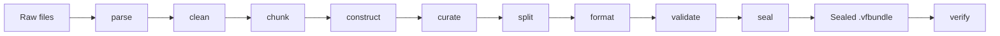

# Veriformis

**Local-first dataset compiler: raw documents to validated, provenance-sealed fine-tuning bundles.**

[](pyproject.toml)
[](LICENSE)
[](https://docs.astral.sh/uv/)

Veriformis is a local-first compiler that turns heterogeneous raw source
material into a curated, split, validated, and sealed training dataset. It owns
the difficult path from source capture through the finished bundle. Cleaned
text is an accountable intermediate state, except when a `full_text` recipe
explicitly selects it as training content.

> **Development alpha:** Version `0.1.0` implements the M1 core and roadmap
> Groups 1 through 7, plus Group 9 automated release gates (matrix CI, install
> smoke, golden compile). This is **not** a beta or public release label.
> Hard non-claims and operator limits:
> [docs/beta-limitations.md](docs/beta-limitations.md). Signed/notarized Mac
> public readiness remains an owner checklist —
> [docs/release.md](docs/release.md). Read the
> [current implementation status](docs/current-status.md) before treating this
> alpha as shippable.

## What works today

The active compiler path runs nine stage-gated stages from raw files to a
sealed bundle, verified by a separate command:



Version `0.1.0` provides:

- local parsing for plain text, Markdown, DOCX, HTML, digitally-born PDF, CSV,
  JSON, JSONL, and selected source-code files;
- immutable workspace revisions with atomic commits and stale-stage invalidation;
- source-scoped identities for sources, artifacts, transforms, chunks, and revisions;
- strict canonical IR, parser diagnostics, source evidence, and replayable cleaning plans;
- paragraph, fixed, sliding, sentence, and structure-aware chunking;
- five deterministic training objectives: `full_text`, `continuation`,
  `section_reconstruction`, `before_after_transformation`, and
  `structured_field`;
- field-level evidence, candidate decisions, optional review evidence, and
  immutable accepted records;
- deterministic curation with target-length filtering, conflict quarantine,
  exact deduplication, optional primary-source caps, and coverage accounting;
- authoritative train and evaluation assignment by complete transitive leakage groups;
- one-to-one lowering into `text`, `prompt_completion`,
  `instruction_output`, or structured `messages` rows;
- payload-only partition JSONL plus an aligned provenance stream;
- exact-snapshot validation through 17 ordered gates;
- an atomic six-file `minimal-v1` bundle with closed-set verification; and
- `self_consistent` verification, or `external_digest` verification when the
  caller supplies the manifest SHA-256 retained outside the bundle.

The pipeline makes no LLM calls and sends no document to a network service.

## macOS workbench

A SwiftUI adapter lives under [`macos/`](macos/README.md). It shells to the same
`veriformis` CLI used by terminal workflows so digests match. Build with
XcodeGen + Xcode; run `./macos/scripts/parity_check.sh` for CLI sequence parity.

## Supported inputs

| Category | Extensions |
| --- | --- |
| Text | `.txt` |
| Markdown | `.md`, `.markdown` |
| Word | `.docx` |
| Source code | `.py`, `.js`, `.ts`, `.java`, `.c`, `.cpp`, `.go`, `.rs`, `.rb`, `.sh` |

Other extensions fail with an `unsupported-input` error.

## Development setup

Veriformis requires Python 3.11 or newer and uses
[uv](https://docs.astral.sh/uv/).

```bash
git clone https://github.com/ogprotege/Veriformis.git
cd Veriformis
uv sync --extra test
uv run veriformis version
```

The last command should print `0.1.0`.

## Raw source to verified bundle

Use at least two independent sources for the default required evaluation
partition:

```bash
uv run veriformis parse source-a.txt source-b.txt -o build/workspace
uv run veriformis clean build/workspace
uv run veriformis chunk build/workspace --strategy paragraph
uv run veriformis construct build/workspace --objective full_text
uv run veriformis curate build/workspace
uv run veriformis split build/workspace
uv run veriformis format build/workspace
uv run veriformis validate build/workspace
uv run veriformis seal build/workspace -o build/example.vfbundle
uv run veriformis verify build/example.vfbundle
```

`seal` prints the manifest SHA-256. Retain it outside the bundle when an
independent trust anchor matters, then verify with:

```bash
uv run veriformis verify build/example.vfbundle \
  --manifest-sha256 EXPECTED_MANIFEST_SHA256
```

Without the external digest, verification correctly reports
`self_consistent`. With a matching digest, it reports `external_digest`.

For a corpus with only one leakage group, the default split cannot create both
partitions. Pass `--allow-empty-evaluation` to `curate` only when an empty
evaluation partition is intentional.

For a supervised recipe, choose its objective and target row schema during
construction. For example:

```bash
uv run veriformis construct build/workspace \
  --objective continuation \
  --target-row-schema messages
```

The later commands infer the row schema from the bound recipe and plan. They do
not accept a second format label that could contradict it. Only
`instruction_output` requires `curate --instruction TEXT`.

## Finished bundle

A successful Group 3 seal writes exactly:

```text
example.vfbundle/
├── data/train.jsonl
├── data/evaluation.jsonl
├── metadata/row-provenance.jsonl
├── validation.json
├── manifest.json
└── attestation.json
```

The payload files contain only the selected training schema. Provenance remains
in its aligned metadata stream. The co-located attestation proves internal
agreement, not external authenticity. The optional expected manifest digest
provides the external binding.

Group 3 validates Aptus row shape. Group 6 adds the versioned sibling Aptus
handoff (`*.aptus-handoff.json`) and `handoff-verify` consumer checks. Live
training remains Aptus's job. Current Aptus MLX intake still rejects plain
`text` rows; the handoff records that limit.

## Workspace integrity

The physical workspace layout remains schema 1. Active revisions use schema 3
and the full stage graph. `HEAD` selects one immutable revision, and that
revision maps logical outputs to content-addressed objects under
`objects/sha256/`.

Use `upgrade-workspace` to migrate a verified revision-v1 or revision-v2
workspace through every supported migration. The v2 to v3 migration preserves
parse, clean, chunk, and construct history. It retires legacy downstream state
instead of reinterpreting chunk projections as finished-dataset evidence.

Persisted artifact JSON and durable identity payloads preserve exact Unicode
strings and object-key sequences. NFC normalization applies only to explicit
locator fields whose contracts define that equivalence, currently logical
source paths.

## Current boundary

**Groups 1 through 7 are implemented** on `main` (compiler through workbench).
**Group 9 automated release gates** (matrix CI, install smoke, golden compile,
release runbook) are in place. This is still a development alpha: **public
readiness** still requires owner Mac signing/notarization evidence per
[docs/release.md](docs/release.md). **Group 8** model-assisted construction is
optional and owner-gated.

## Documentation

The [documentation index](docs/README.md) defines document authority and
reading paths. The map:

- **Product and status**
  - [Product contract](docs/product-contract.md) — ownership boundary and non-claims
  - [Current implementation status](docs/current-status.md) — exact alpha boundary
  - [Work in progress](WIP.md) — non-authoritative tracker
- **Architecture**
  - [Architecture hub](docs/architecture.md)
  - [Architecture tree](docs/architecture/README.md)
- **Contracts**
  - [Integrity Contract v1](docs/contracts/integrity-v1.md)
  - [Dataset Construction Contract v1](docs/contracts/dataset-construction-v1.md)
  - [Finished Dataset Contract v1](docs/contracts/finished-dataset-v1.md)
  - [Aptus Handoff Contract v1](docs/contracts/aptus-handoff-v1.md)
- **Reference and plans**
  - [CLI reference](docs/cli.md)
  - [Development guide](docs/development.md)
  - [Release guide](docs/release.md)
  - [Beta limitations](docs/beta-limitations.md)
  - [macOS workbench](macos/README.md)
  - [Authoritative build roadmap](docs/plans/2026-07-29-veriformis-roadmap.md)
  - [Contributing](CONTRIBUTING.md)

## Development checks

```bash
uv lock --check
uv run ruff check src tests
uv run pytest -q
git diff --check
```

Post–Group 7 merge on `main`: `655 passed`. CI currently runs Ruff and pytest
on Ubuntu with Python 3.12. Broader package, platform, type, coverage, security,
and release gates remain Group 9 work.

## License

Veriformis is provided under the [MIT License](LICENSE).
