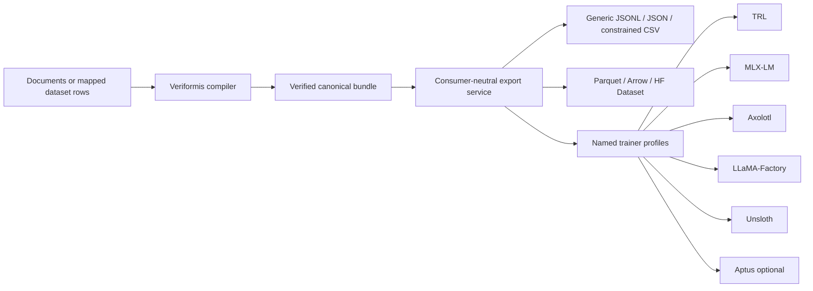

# Veriformis Independent Product Analysis

**Status:** Evidence baseline for the independent-product roadmap

**Analysis date:** 2026-08-11

**Repository baseline:** `7d116e9c09fb4c64f38b2db2572f820a83c53dba`

**Scope:** Current architecture, product boundary, input and output coverage,
training-goal semantics, trainer ecosystem requirements, macOS workbench,
quality evidence, and release implications

## Executive finding

Veriformis already contains the hard foundation of an independent product. Its
typed composition root, content-addressed workspace, deterministic
construction, curation, leakage-safe split, exact validation, atomic seal, and
independent bundle verifier do not depend on Aptus. The main problem is product
framing and the absence of a consumer-neutral export system: Aptus handoff is
enabled by default in the CLI, MCP server, and Mac workbench; workbench copy
recommends Aptus-friendly choices; and the prior roadmap makes an Aptus
handoff part of the release path.

The correct next move is therefore not to rebuild the compiler around another
trainer. Veriformis should keep one integrity-bearing, consumer-neutral
finished bundle as its canonical artifact, then derive verified export packs
for useful containers and named trainer profiles. Aptus becomes one optional
profile beside others. A user should be able to install Veriformis, import
supported source material or existing dataset rows, state a training goal,
inspect the result, compile and verify it, and export a training-ready dataset
without Aptus being installed, named, or required.

## Evidence examined

The local evidence includes the product and dataset contracts, architecture,
current status, release and limitation documents, the two existing roadmaps,
all Python package modules, the CLI and MCP seal paths, Swift workbench source,
the test layout, and retained GUI outputs. The analyzed repository contains
approximately 28,496 lines of Python package code, 50 Python test files, 468
Python test functions, and 12 Swift test functions. At this baseline, the
project verification run recorded a valid lockfile, clean Ruff result, 658
passing Python tests, 12 passing Swift tests, and CLI/workbench parity.

The external evidence is limited to primary or official trainer and dataset
documentation:

- [Hugging Face TRL dataset formats](https://huggingface.co/docs/trl/dataset_formats)
  distinguishes language-modeling, prompt-only, prompt-completion,
  conversational, preference, unpaired-preference, and stepwise-supervision
  data. This establishes that training semantics cannot be represented by a
  file extension alone.
- [TRL SFTTrainer](https://huggingface.co/docs/trl/en/sft_trainer) accepts
  language-modeling and prompt-completion data in standard or conversational
  representations, including model-bound pre-tokenized inputs. This supports
  keeping tokenized output outside the generic canonical artifact.
- [Hugging Face Datasets loading](https://huggingface.co/docs/datasets/about_dataset_load)
  documents text, CSV, JSON/JSONL, Parquet, and Arrow ingestion, while the
  [Dataset Viewer Parquet documentation](https://huggingface.co/docs/dataset-viewer/en/parquet)
  documents the split-to-file and columnar implications of Parquet.
- [MLX-LM LoRA data documentation](https://github.com/ml-explore/mlx-lm/blob/main/mlx_lm/LORA.md)
  documents local `train.jsonl`, optional `valid.jsonl` and `test.jsonl`, plus
  text, completion, and chat/message shapes. File naming and split naming are
  therefore consumer-profile concerns, not canonical dataset semantics.
- [Axolotl dataset formats](https://docs.axolotl.ai/docs/dataset-formats/)
  distinguish pretraining, SFT, conversation, instruction, template-free,
  pre-tokenized, streaming, and RLHF forms. Its chat-template and masking
  choices reinforce the need for explicit consumer and loss-policy profiles.
- [LLaMA-Factory data documentation](https://github.com/hiyouga/LlamaFactory/blob/main/data/README.md)
  documents Alpaca and ShareGPT mappings, preference fields, a
  `dataset_info.json` sidecar, and JSON, JSONL, CSV, Parquet, and Arrow file
  types. A useful adapter may need both data files and configuration sidecars.
- [Unsloth's dataset guide](https://unsloth.ai/docs/get-started/fine-tuning-llms-guide/datasets-guide)
  and [chat-template guide](https://unsloth.ai/docs/basics/chat-templates)
  distinguish raw-corpus, instruct, conversation, template, standardization,
  and tokenization concerns.

These sources do not prove that every listed format belongs in Veriformis.
They prove that a credible independent tool needs an explicit semantic model,
versioned consumer profiles, and conformance tests. Each actual adapter still
needs a named user workflow, official contract, loss model, fixture, and
maintenance decision.

## Current product boundary

The implemented core is a Python 3.11+ modular monolith. `PipelineService` is
the typed composition root; Typer CLI, local MCP, and the Swift workbench are
adapters. The nine replay-gated stages are:

The workspace is content-addressed and transactional. Every persisted stage is
bound to its inputs, and rerunning an ancestor invalidates its descendants.
The finished bundle is a closed six-file directory containing train and
evaluation JSONL, aligned provenance, validation, manifest, and attestation.
This is already a strong canonical compilation artifact.

The compiler implements five deterministic objectives: full text,
continuation, section reconstruction, before/after transformation, and
structured field. It lowers accepted records into four semantic row schemas:
`text`, `prompt_completion`, `instruction_output`, and `messages`. These are
more general than Aptus. The existing contract even states that a training
objective is not a row shape or serializer name.

## Supported and missing input behavior

`src/veriformis/parsers/dispatch.py` declares TXT, Markdown, DOCX, HTML,
digitally-born PDF, CSV, JSON, JSONL, and selected code suffixes. Parser loss is
explicit, and image-only PDFs fail with a named OCR limitation. This is a real
heterogeneous-source baseline, not an aspirational claim.

Three materially different input jobs are not yet separated in the product:

1. Document compilation recovers content and structure from documents and
   constructs training examples.
2. Dataset normalization imports rows that already contain training semantics,
   maps their columns or roles, validates them, and exports them elsewhere.
3. Collection ingestion expands directories, archives, or remote datasets into
   individually governed sources.

Veriformis primarily implements the first job. CSV, JSON, and JSONL are parsed
as structured source material, but there is no first-class user-directed row
mapping flow for an existing Alpaca, ShareGPT, OpenAI-messages, preference, or
custom-column dataset. That is a significant gap for the independent product
described by the owner.

OCR is another explicit gap. It should remain fail-closed until an optional
local recovery path can record engine identity, model/language data, page
coverage, confidence or quality facts, and a review requirement. Silently
passing poor OCR text into training would violate the existing evidence model.

## Supported and missing output behavior

The formatter already creates useful JSONL bytes, but they are only published
inside `minimal-v1`. There is no generic `export` composition root, export
plan, export receipt, consumer profile, or round-trip/conformance suite. The
prior workbench plan treats plain JSONL copying as an optional convenience and
Parquet or Arrow as distant post-processing. That understates the product goal.

The output problem has four independent axes:

| Axis | Question | Current state |
| --- | --- | --- |
| Training family and objective | What should be learned and which fields receive loss? | Five deterministic objectives; no preference or generated-data objective |
| Semantic row schema | What does each field mean? | Four strict row schemas |
| Physical container | How are rows stored and split? | Canonical JSONL inside `minimal-v1` only |
| Consumer profile | What names, sidecars, templates, masking, and restrictions does a trainer require? | Aptus-specific sibling descriptor only |

Treating these as one “format” selector would produce invalid datasets. For
example, MLX-LM's `valid.jsonl` name differs from Veriformis's
`evaluation.jsonl`; LLaMA-Factory may require `dataset_info.json`; Axolotl
requires dataset type, chat-template, key mapping, and masking choices; and a
Parquet container can hold several different semantic row types. The product
must ask for training intent before it asks for a destination container.

## Aptus coupling assessment

There is no architectural dependency from the compiler kernel to Aptus.
`src/veriformis/handoff/aptus_v1.py` is a sibling adapter over a verified
bundle. The coupling is caused by defaults and product authority:

- CLI `seal` defaults `--aptus-handoff` to true.
- MCP `seal` defaults `write_handoff` to true.
- The workbench exposes Aptus handoff in the primary compile form and result.
- Home copy advises choosing an Aptus-friendly objective.
- Release evidence and old roadmap exit gates include handoff verification.
- The product contract describes Aptus as the downstream owner instead of one
  possible consumer.

The independence correction is therefore small in code but large in product
meaning. Standalone seal and verify must become the default and the required
release path. Aptus tests remain valuable as optional integration tests, but
they cannot be prerequisites for installing, compiling, exporting, or
releasing Veriformis.

## macOS artifact and concurrency evidence

The Swift workbench remains a thin CLI adapter, which is the right boundary.
Two concrete defects need to be closed before broadening the UI:

- `WorkbenchViewModel` is main-actor isolated and starts a plain `Task`, while
  `VeriformisCLI.run` synchronously calls `process.waitUntilExit()`. The live
  compiler process can therefore block UI responsiveness even though pipe
  callbacks dispatch log updates.
- A retained Finder-exposed `.vfbundle` contains `.DS_Store`. The strict bundle
  verifier correctly rejects unexpected files in the closed directory set.
  A directory that Finder can mutate is not a reliable distributable artifact
  without package behavior or a deterministic immutable archive boundary.

These are current-evidence issues, not speculative roadmap features, and they
belong before major workbench expansion.

## Quality and scale assessment

The existing integrity system is unusually strong for an alpha dataset tool:
source hashes, immutable evidence, deterministic constructors, explicit
curation decisions, exact deduplication, source-conflict quarantine,
leakage-group splitting, 17 validation gates, manifest-bound file sets, and
independent verification are implemented.

The remaining quality gap is decision support rather than basic correctness.
Users need preflight and post-compile facts that help them decide whether a
dataset is suitable: row distributions, source coverage, exclusions, target
lengths, near-duplicates, split comparability, tokenizer-bound token lengths,
label or role balance, and optional policy scans. Near-duplicate, PII, secret,
license, and contamination checks must be described as findings under a named
algorithm and reference set, not as absolute guarantees.

There is no retained performance benchmark or declared corpus tier in the
current evidence. The pipeline frequently materializes complete bytes and
model objects. It would be unfounded to declare scale targets now. The factual
sequence is to create reproducible benchmarks first, record throughput, peak
memory, disk, and cancellation behavior on named hardware, then set and meet
targets through streaming, incremental processing, and sharded exports.

## Recommended architecture

The finished bundle should remain the authoritative internal product artifact.
Exporters should be pure, versioned consumers of a verified bundle, with a
receipt that binds the source manifest digest, export plan, profile version,
and exact output file set.

The export service must not mutate accepted records, re-curate, re-split, or
infer masking. A profile may rename partitions, map keys, emit sidecars, or
render a model-bound representation only when its contract states the loss
boundary and verification rules. Network publication is a separate opt-in
adapter after local export has passed.

## Scope controls

“Many formats” should mean a useful, verified, extensible set—not an
unmaintainable promise to convert anything into anything. An input, container,
or consumer profile should enter the supported matrix only after it has:

1. A named training workflow and user evidence.
2. A primary specification or official consumer contract.
3. An explicit semantic and loss model.
4. A deterministic parser or writer with documented loss behavior.
5. Golden fixtures and negative cases.
6. Round-trip or actual-consumer conformance evidence.
7. Versioning, deprecation, and maintenance ownership.

This admission rule is how the roadmap remains evidence-based as ecosystems
change. Candidates can be researched without being advertised as supported.

## Conclusion

The independent product is achievable by extending the current architecture,
not discarding it. The critical path is: correct product authority and
defaults; close known workbench and artifact defects; formalize training goal,
row, container, and consumer-profile axes; implement a verified export layer;
add first-class existing-dataset mapping; then expand useful formats,
quality, scale, and UX behind evidence gates. Aptus survives as an optional
adapter and no longer defines Veriformis's purpose or release readiness.

The phased execution authority is the
[Independent Product Roadmap](../plans/2026-08-11-veriformis-independent-product-roadmap.md).
