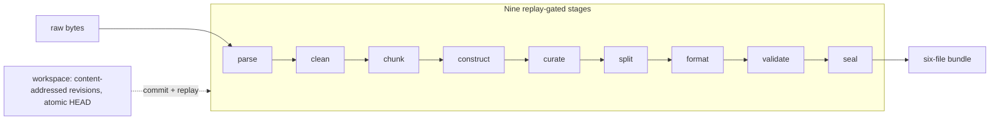

# Architecture

**Last reviewed:** 2026-08-21 (independent-product Phase 4 closeout)

**Next review:** Any service-boundary or architecture change

Veriformis `0.1.0` is a Python 3.11+ modular monolith with a typed
composition root, `veriformis.pipeline.PipelineService`, and multiple thin
adapters: the `veriformis` CLI, constrained local MCP (`veriformis.mcp`), and
the SwiftUI workbench under `macos/` (CLI shell). Domain modules own strict
persisted contracts and pure transformations; adapters must not reimplement
stage policy. Workspace state is content-addressed and replay-gated.

This hub holds the pipeline at a glance, the module map, and the operational
layouts; the overview and four citation-backed deep dives live under
[architecture/](architecture/README.md).

## Pipeline at a glance



Clean corpus state is intermediate unless `full_text` selects it as the exact
training target; other objectives derive explicit context and target fields.

## Module map

A foundation kernel (`errors.py`, `contracts.py`, `identity.py`,
`diagnostics.py`, `sources.py`, `evidence.py`) holds the shared exception
taxonomy, schema and gate registries, canonical-JSON identity substrate, and
provenance model. Above it sit `ir/` (the canonical document model) and six
stage packages in pipeline order — `parsers/`, `rules/`, `chunkers/`,
`construction/`, `datasets/`, `bundle/` — flanked by axial modules:
`workspace.py` (revision kernel); `pipeline/` (`PipelineService`); `recipes/`;
`exports/` (consumer-neutral verified-derivative composition boundary);
`handoff/`; `mcp/`; and `cli.py` (Typer adapter). Phase 4 establishes the
typed export service, descriptor-anchored verified source view, strict
persisted export models, fail-closed source-trust admission, and read-only
source-derived plan population and normalized semantic membership enforcement,
plus internal exact-byte atomic publication and independent closed-tree
verification. Phase 4.7 adds private two-render evidence: exact profiles compare
normalized byte trees, while semantic profiles compare versioned canonical
preimages and reconstructed membership and replay descriptor-reread staged
bytes. Phase 4.8 adds a production-empty private implementation catalog and
thin `PipelineService`, CLI, MCP, and CLI-backed Mac operations for discovery,
dry run, self-described inspect, execute, and source-bound verify. No production
renderer or semantic replayer or supported derivative container ships. The macOS workbench lives
outside the Python package under `macos/`. Retained legacy packages
(`serializers/`, `validate/`) have no production callers.

Deep dives: [Layers](architecture/layers.md) — stack and isolation;
[Dependencies](architecture/dependencies.md) — fan-in and containment;
[Data flow](architecture/data-flow.md) — shapes and provenance;
[Entry points](architecture/entry-points.md) — commands, transactions.

## Transactional workspace

Physical layout (workspace layout schema 1):

```text
workspace/
├── workspace.json
├── HEAD
├── LOCK
├── objects/
│   └── sha256/<prefix>/<digest>
├── revisions/
│   └── <revision-id>/revision.json
└── .txn/
```

- Active workspaces use revision schema 3. `HEAD` is the only mutable commit
  pointer; commits hold an exclusive `LOCK`, require the expected parent, and
  leave the prior revision current if interrupted pre-commit.
- Opening a workspace re-verifies every revision in the active parent chain
  and re-hashes every referenced object; altered bytes fail closed.
- If `HEAD` changes but the final directory sync fails, the API returns the
  visible revision with a durability warning rather than reporting rollback.
- `upgrade-workspace` migrates revision v1 through v2 to v3 stepwise: v2 to
  v3 preserves parse, clean, chunk, and construct facts, adds curate and
  split as absent, and retires legacy format, validate, and seal state.

## Stage graph

Rerunning a stage invalidates all descendants.

| Stage | Direct dependencies | Logical output keys |
| --- | --- | --- |
| `parse` | none | `registry`; per-source `raw`, `canonical`, `document`, `diagnostics` |
| `clean` | `parse` | `transforms`; per-source `document`, `cleaning-plan`, `block-derivations` |
| `chunk` | `clean` | `chunks` |
| `construct` | `parse`, `clean`, `chunk` | `recipe`, `result` |
| `curate` | `construct` | `plan`, `result` |
| `split` | `construct`, `curate` | `result` |
| `format` | `construct`, `curate`, `split` | `row-set`, `train`, `evaluation`, `provenance` |
| `validate` | all of `parse`–`format` | `snapshot`, `report` |
| `seal` | all of `parse`–`validate` | `manifest`, `attestation` |

## Finished bundle layout

The exact `minimal-v1` file set (`.vfbundle` is conventional, not enforced):

```text
name.vfbundle/
├── data/train.jsonl
├── data/evaluation.jsonl
├── metadata/row-provenance.jsonl
├── validation.json
├── manifest.json
└── attestation.json
```

- Seal rebuilds the validation report, requires byte-semantic equality with
  the saved passing report, and publishes: staged in a private sibling
  directory, fsynced, independently verified, atomically renamed without
  overwrite.
- The manifest binds exact paths, roles, media types, sizes, digests, record
  counts, snapshot, validation report, and content root; it does not hash
  itself. The co-located attestation binds the exact manifest digest.
- Trust grades state the evidence limit: `self_consistent` proves internal
  agreement only; `external_digest` adds a matching expected manifest
  SHA-256 from a separate trusted channel. Without that retained digest a
  bundle is internally consistent, not externally authenticated.
- Publication assumes an integrity-controlled destination parent: the
  no-replace rename protects cooperating writers, not a hostile same-owner
  process renaming parent entries mid-rename (see the
  [contract](contracts/finished-dataset-v1.md)).
- Finder-facing transport uses a deterministic `.vfbundle.zip` containing
  those exact six paths. Packaging requires `external_digest` verification;
  archive verification reconstructs the strict directory and reuses the same
  canonical verifier. This is transport only, not a trainer export. See
  [ADR 0005](adr/0005-deterministic-bundle-transport.md).
- Phase 4 derivatives start from `ExportService`, which obtains manifest,
  validation, row-set, and verification facts in the bundle verifier's same
  descriptor-anchored pass. Export-source admission requires a retained
  expected manifest digest by default; lower self-consistent trust must be
  selected explicitly, and supplied evidence never falls back. Its read-only
  `create_plan` operation derives every source identity and the complete source
  membership baseline from that immutable pass; callers provide only profile,
  dependency, and file-plan evidence. `create_plan` is not a workspace stage,
  does not reopen source paths, and does not mutate `minimal-v1` or write
  destination content.
- Its read-only `validate_derivative_membership` operation fresh-reconstructs a
  candidate `RowSet` from normalized train/evaluation rows and aligned
  provenance, then requires exact planned row-set and complete projection
  equality. It does not inspect produced destination bytes.
- Its internal `publish` operation is reachable through Python composition and
  supports private exact-byte and semantic-content conformance. It re-verifies
  the source and plan, renders twice from independent strict inputs, validates
  normalized membership for both results, compares either complete byte trees
  or versioned canonical semantic preimages, and uses descriptor-anchored
  staging plus one atomic no-replace promotion. Semantic output is replayed from
  staged descriptors before verification.
- Phase 4.8 adds an exports-owned private implementation catalog plus strict
  discovery, dry run, self-described inspect, operator-confirmed execute, and
  source-bound verify operations through `PipelineService`, CLI, MCP, and the
  CLI-backed Mac bridge. Execute reaches the same internal publisher; adapters
  do not implement filesystem policy. The production catalog is empty, the
  default service has no renderer or semantic replayer, and no generic
  container is supported.

## Related documentation

- [Product contract](product-contract.md)
- [Integrity Contract v1](contracts/integrity-v1.md)
- [Dataset Construction Contract v1](contracts/dataset-construction-v1.md)
- [Finished Dataset Contract v1](contracts/finished-dataset-v1.md)
- [Current implementation status](current-status.md)
- [CLI reference](cli.md)
- [Development guide](development.md)
- [Independent product roadmap](plans/2026-08-11-veriformis-independent-product-roadmap.md)
