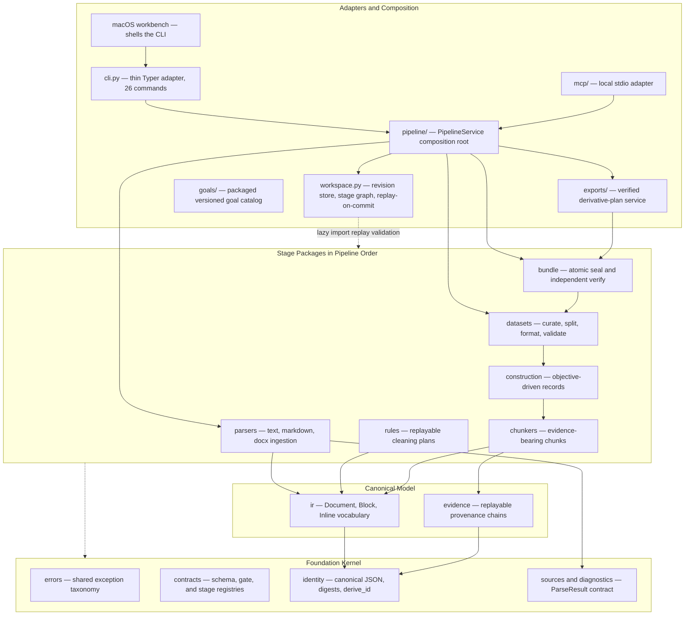

# Architecture

The entry point to the Veriformis architecture documentation: a system
overview, the top-level module diagram, and an index into the four deep-dive
references that carry the verified, citation-backed detail.

**Last reviewed:** 2026-08-22 (independent-product Phase 5 closeout)

**Next review:** Any architecture documentation change

## System overview

### Domain boundary and positioning

Veriformis occupies a specific and deliberately narrow position in the
data-engineering landscape: it is a local-first compiler for fine-tuning
datasets, transforming heterogeneous raw documents — plain text, source code,
Markdown, DOCX, HTML, digitally-born PDF, CSV, JSON, and JSONL — into sealed,
independently verifiable training bundles.
The system's stated product promise frames the entire corpus-to-dataset
trajectory as a compilation problem rather than an ad-hoc scripting task (see
`docs/product-contract.md:19`), and this framing defines both what the system
owns and what it refuses to own. The ownership boundary runs from raw source
capture through final seal: ingestion, canonical recovery, cleaning, evidence
preservation, record construction, curation, leakage-safe splitting,
formatting, validation, and bundle publication all live inside the system.
Training itself does not. Any trainer or training orchestrator begins where a
sealed Veriformis bundle ends. Aptus is one optional consumer integration,
implemented through a sibling handoff descriptor; it is not part of the
canonical six-file bundle or the orchestration root. This division matters
architecturally because it converts dataset preparation from a disposable
preprocessing step into an artifact with its own integrity guarantees. The
design enforces that boundary through fail-closed sealing: a dataset is not
considered finished because a JSONL file exists, but only when the exact
validated snapshot, manifest, and attestation agree (see
`docs/product-contract.md:159`).

The core problem the system addresses is accountability in dataset
construction. Conventional dataset pipelines — shell scripts, notebooks,
one-off Pandas transformations — produce outputs whose provenance is
unrecoverable: which source bytes produced which training row, which edits
were applied, and whether a rerun would reproduce the same result are
questions such pipelines cannot answer. Veriformis answers them structurally.
Every stage emits explicit evidence rather than silent transformation, a
doctrine the product contract names "honest loss accounting": parsing loss,
cleaning edits, construction omissions, curation exclusions, and deduplication
each produce inspectable records instead of disappearing (see
`docs/product-contract.md:112`). Consequently, the system positions itself
against the implicit tolerance for silent mutation that pervades dataset
tooling, and its architecture is best understood as the enforcement machinery
for that position.

### Architectural paradigm

The architecture embodies three mutually reinforcing paradigms:
compiler-style pipeline architecture, stage-gated transactional processing,
and content-addressed identity. The compiler metaphor is not decorative; it is
load-bearing. The system has a recognizable front end, intermediate
representation, and back end. Parsers recover raw bytes into a canonical
`Document` IR with a mandatory diagnostics report, exactly as a language
front end produces an AST plus diagnostics (see
`src/veriformis/parsers/dispatch.py:31`). The IR — a `Document`/`Block`/
`Inline` tree serialized under the strict `veriformis.ir/v1` schema (see
`src/veriformis/ir/serde.py:12`) — is the shared intermediate vocabulary that
every transformation consumes and produces, which is precisely the role an IR
plays in a multi-pass compiler. The back end lowers semantic records into
target bytes: the format stage serializes accepted records into JSONL row
streams much as a code generator lowers IR into object code (see
`src/veriformis/datasets/serialization.py`). The root reason for this choice
is that compilation theory already solved the problem the domain presents: how
to keep a long chain of lossy transformations auditable. The answer — one
canonical representation, explicit passes, and diagnostics instead of silent
degradation — transfers directly.

Stage-gated transactional processing supplies the execution discipline. The
nine stages — parse, clean, chunk, construct, curate, split, format, validate,
seal — form an explicit dependency graph declared in the workspace kernel (see
`src/veriformis/workspace.py:138`), where each stage reads its predecessors'
artifacts from an immutable revision and commits its own atomically; rerunning
a stage invalidates all descendants. The pivotal rule is replay-before-commit:
a stage's outputs are accepted only after deterministic re-execution
reproduces them, and the workspace itself reloads and semantically replays the
Group 3 stages before promoting `HEAD` (see `src/veriformis/workspace.py:2074`).
This design exists because reproducibility cannot be a testing afterthought in
a system whose product is verifiability; it must be a precondition of state
transition. The impact is that the workspace, not the CLI, is the real
control-flow backbone — pipeline ordering is enforced by revision state, not
by any orchestrator's good behavior.

Content-addressed identity binds the first two paradigms together. Every
persisted model derives its identity from its complete semantic payload
through `derive_id`, producing domain-separated `kind-v1-<64 hex>` identifiers
over exact-string canonical JSON (see `src/veriformis/identity.py:137`), and a
validator recomputes that identity on every load, failing on any drift. The
reason for this rigor is that verification claims are only as strong as the
bytes they cover; approximate serialization would make every downstream digest
negotiable. Consequently the system treats canonical JSON — floats rejected,
duplicate keys rejected, Unicode normalization applied only to declared
locator fields — as a correctness mechanism, not a style preference.

### Core technology decisions

The technology stack is small and each choice maps onto a non-functional
requirement. Python 3.11+ is the substrate, chosen for ecosystem proximity to
its problem domain — document processing and machine-learning tooling — and
the modular-monolith organization keeps deployment to a single installed
console script (see `pyproject.toml`). Typer provides the CLI surface and is
confined to `cli.py`. That module is a thin adapter over the implemented,
surface-neutral `PipelineService`; the same service also backs local MCP tools,
while the SwiftUI workbench invokes the CLI. Pydantic serves as the persisted-contract
backbone: fourteen modules — precisely those that own on-disk schemas in
construction, datasets, bundle, and the workspace revisions themselves —
build strict, frozen, extra-forbidden models whose validators recompute
content-derived identities at load time. This choice directly serves the
verifiability requirement, because model validation becomes the first rung of
a defense-in-depth ladder that continues through stage-entry replay, snapshot
gates, seal-time rebuild, and independent verification.

External dependencies are contained with unusual discipline, which serves the
correctness requirement by bounding blast radius. Format libraries remain at
the ingestion edge: Markdown uses markdown-it-py and mdit-py-plugins, DOCX uses
python-docx and lxml, and PDF uses pypdfium2. PyYAML is confined to versioned
pipeline recipes, MCP to the local stdio adapter, Typer to the CLI, and
jinja2 to the retained chat renderer. The workspace revision store is a custom,
dependency-free persistence kernel — content-addressed objects under
`objects/sha256/`, immutable revisions, an atomic `HEAD` pointer, and an
exclusive-lock commit protocol (see `src/veriformis/workspace.py:1737`) —
rather than an off-the-shelf database. This is a deliberate decision: a
general-purpose store could not express the system's central invariant, that
committing a revision requires semantically replaying the stage being
committed. The cost of that decision is concentration — the kernel is the
largest module in the system — but the payoff is that durability, ordering,
and replay validation share one transaction boundary, which is exactly where
the reproducibility guarantee must live.

### Top-level module division

The highest-level division separates four kinds of units. The foundation
kernel — `errors.py`, `contracts.py`, `identity.py`, plus the `diagnostics`,
`sources`, and `evidence` modules — holds the primitives every other layer
shares: a common exception taxonomy, a zero-dependency registry of schema IDs,
gate names, and reason codes, the identity substrate, and the provenance model
whose `SourceEvidence` chains make any post-parse text replayable to immutable
source ranges (see `src/veriformis/evidence.py:59`). Above it sit the
canonical model (`ir/`) and the six stage packages in pipeline order, each
owning one stage's pure, deterministic transformation: parsers recover, rules
clean through plan/replay separation (see
`src/veriformis/rules/cleaning.py:737`), chunkers segment, construction builds
objective-driven records, datasets curate, split, format, and validate, and
bundle seals and verifies. The axial units beside this stack are
`workspace.py`, the transactional kernel; `pipeline/`, whose
`PipelineService` composes stage behavior and transactions and owns the
injected `exports.ExportService`; plus the thin `cli.py` and `mcp/` adapters.
The export service establishes a typed, consumer-neutral derivative boundary
over a verified finished bundle. It obtains the manifest, validation report,
reconstructed row set, and ordinary `VerificationResult` from one
descriptor-anchored verification pass. It is not a workspace stage, and it
shares strict persisted export plan, profile, membership, file-binding,
receipt, and verification models from `exports/models.py`. Its source admission
defaults to retained external-digest evidence and requires an explicit policy
for lower self-consistent trust. Its read-only `create_plan` derives all source
identities and the complete source membership baseline from that immutable
view; caller input is limited to strict profiles, dependencies, and file plans.
Its read-only membership operation fresh-reconstructs normalized candidate
train/evaluation rows and provenance, then requires exact row-set and complete
projection equality with the plan. Its internal publication operation then re-
verifies the source and plan and renders twice from independent strict inputs.
Exact profiles require identical normalized byte trees; semantic-only profiles
require equal versioned canonical semantic preimages and reconstructed
membership from both renders plus descriptor-reread staged replay. Phase 4.8
adds a private, initially empty implementation catalog and thin Python, CLI,
MCP, and CLI-backed Mac export operations. Phase 5.1–5.3 add the catalog's
first three production exact-byte implementations, `split-jsonl-directory`,
canonical `json`, and `constrained-csv` v1. Request v1
uses the safe `train` / `evaluation` filenames and includes aligned provenance;
configured request v2 requires the complete
`veriformis.split-jsonl-options/v1` object and may only change those safe stems
or omit provenance. Canonical JSON uses request v1's fixed dataset/provenance
tree and refuses request v2. All three renderers preserve payloads, ordering,
split policy, and train/evaluation membership, and advertise no consumer or
trainer profile. Constrained CSV uses a fixed fully quoted train/evaluation
tree with mandatory aligned provenance for the three flat row schemas. It
refuses request v2 before source access; after source admission reveals nested
`messages`, it refuses the schema before destination access with a JSON
alternative.
Phase 5.4, merged as PR #56 at
`499d61fa2e7dd12edb5808c6bd9d0e0ab6b738c8`, adds an orthogonal post-export
path rather than another
catalog entry. `exports/archive.py` consumes one canonical receipt-bound
directory and `_archive_transport.py` supplies the deterministic stored-ZIP
codec shared with bundle transport. `PipelineService.package` and
`package_verify` select the `.vfexport.zip` path only from an explicit external
receipt digest. The inner plan, receipt, source trust grade, and three export
selectors remain unchanged. Archive verification is receipt-anchored rather
than source-bound, and no MCP or Mac UI operation is added. Phase 5.5 adds only
test-owned consolidated ordinary-file reload evidence for the eleven compatible
current container/schema pairs, three container tamper cases, and the existing
constrained-CSV/`messages` refusal. It adds no runtime importer, semantic
replayer, surface, taxonomy, support state, or trainer claim.

Phase 5.5 merged as PR #57 at
`c72b8e9ec7bc2746d74404226aa086d497e15db1`. Phase 5.6 stays on the existing
dry-run edge: planning returns the unchanged plan plus one bounded runtime
preview derived from the same admitted `RowSet`. It exposes ordinal-zero
non-empty-partition samples and the sorted relative planned tree plus receipt,
with ASCII-safe whole-row payload inclusion or exact omission. It never calls a
renderer or touches a destination and adds no durable model or dependency edge.

The default service still has no semantic replayer. The CLI exposes the nine
stage commands plus maintenance, inspection, recipe automation, MCP, optional
Aptus handoff, version, and verified-export surfaces.

Collaboration between these units is governed by two mechanisms worth naming
explicitly. The first is the strict acyclic import graph: no lower layer
imports a higher one, verified across the source tree with a single
load-order-safe intra-package exception (`ir/__init__.py` ↔ `ir/serde.py`),
and the layering itself functions as a correctness mechanism — the datasets
package, for instance, never imports chunkers, rules, or ir, so the legacy
chunk-row path is unreachable from the finished-dataset stages by construction
rather than by convention. The second is the lazy function-level import
pattern that lets the workspace kernel remain the architectural hub without
closing the graph into cycles: the kernel imports only contracts, errors, and
identity at module level, deferring its twelve-plus domain imports into the
methods that replay-validate each stage before commit (see
`src/veriformis/workspace.py:2339`). The same trick appears in the independent
verifier (see `src/veriformis/bundle/verifier.py:389`). Taken together, these
mechanisms show an architecture that treats its dependency graph as part of
the product: the guarantees the system sells — determinism, provenance,
verifiability — are enforced as much by where imports point as by what the
code computes.

## Deep-dive documents

| Document | Contents |
| --- | --- |
| [Layers](layers.md) | The strict acyclic layer stack, responsibility allocation, the lazy-kernel and serde-membrane isolation techniques, and exception flow |
| [Dependencies](dependencies.md) | The fan-in kernel, external-dependency containment, the pydantic posture, deferred imports, and versioning governance |
| [Data flow](data-flow.md) | Shape evolution across the nine stages, the provenance backbone, egress separation, persistence, and defense in depth |
| [Entry points](entry-points.md) | The shared service root, CLI/MCP/workbench adapters, stage transactions, seal path, and independent verifier |

## Related documentation

- [Architecture hub](../architecture.md) — pipeline at a glance, workspace
  layout, stage graph, and bundle layout
- [CLI reference](../cli.md)
- [Development guide](../development.md)
- [Current implementation status](../current-status.md)
- [Product contract](../product-contract.md)
- [Integrity Contract v1](../contracts/integrity-v1.md)
- [Dataset Construction Contract v1](../contracts/dataset-construction-v1.md)
- [Finished Dataset Contract v1](../contracts/finished-dataset-v1.md)
- [Deterministic Archive Transport v1](../contracts/bundle-transport-v1.md)
- [Split JSONL Export Contract v1](../contracts/split-jsonl-export-v1.md)
- [Canonical JSON Export Contract v1](../contracts/canonical-json-export-v1.md)
- [Constrained CSV Export Contract v1](../contracts/constrained-csv-export-v1.md)
- [ADR-0006: Receipt-Anchored Export-Pack Transport](../adr/0006-receipt-anchored-export-pack-transport.md)
- [Independent product roadmap](../plans/2026-08-11-veriformis-independent-product-roadmap.md)
