# Data flow

How data changes shape across the nine stages: immutable content-addressed
shapes whose identities are recomputed at every boundary, the provenance
backbone that makes post-parse text replayable, the payload/provenance
separation at egress, and the workspace persistence machinery underneath.

**Last reviewed:** 2026-08-11 (active implementation reconciliation)

**Next review:** Any architecture or data-flow change

The pipeline organizes its entire data lifecycle as a chain of immutable,
content-addressed shapes whose identities are recomputed at every boundary.
One identity substrate serves every stage: `derive_id` hashes a
domain-separated prefix together with exact-string canonical JSON to mint
`kind-v1-<64hex>` identifiers, while `lossless_json_bytes` guarantees
byte-deterministic serialization through sorted keys, forbidden non-finite
numbers, and NFC normalization applied only to logical locators
(`src/veriformis/identity.py:104-112`, `src/veriformis/identity.py:137-149`,
`src/veriformis/identity.py:169-190`). Because every persisted model derives
its identity from its complete semantic payload and revalidates that identity
on load, the shape evolution across the nine stages is simultaneously the
coupling graph between modules: any upstream drift propagates as an identity
mismatch at the next boundary rather than as silent corruption.

## Ingress: from raw bytes to canonical IR

Data enters the system exactly once, at parse. `register_source` reads or
accepts captured raw bytes, hashes them, normalizes a workspace-relative
logical path, and mints a frozen `SourceRef` whose `src-v1` identity binds
locator to raw digest; a companion `art-v1` artifact identity binds the
extracted canonical text stream to its parser identity, version, and
configuration digest (`src/veriformis/sources.py:45-87`). The design
deliberately retains `extracted_text` in session only
(`src/veriformis/sources.py:26`), so durability flows through digests and the
persisted canonical-stream artifact rather than through retained text. This
choice keeps the persisted surface minimal and forces every later consumer to
address content by hash. Each parser returns a `ParseResult` bundling the IR
`Document`, the `SourceRef`, and a mandatory `ParseReport` whose status is one
of complete, degraded, or refused (`src/veriformis/sources.py:34-38`,
`src/veriformis/diagnostics.py:149-157`). Ingress validation is therefore
structural rather than exceptional: unsupported constructs surface as located
diagnostics, and error diagnostics refuse promotion before any downstream
stage can observe malformed input.

The IR itself is a plain-dataclass tree: a `Document` holds body children plus
footnote and endnote maps keyed by note identity
(`src/veriformis/ir/nodes.py:189-194`), and the `Block` union fixes the nine
legal block kinds (`src/veriformis/ir/nodes.py:171-174`). The pivotal ingress
operation is `attach_canonical_provenance`, which projects every block to
plain text and assigns each a `Span` and monotonic `block_index` into one
canonical extracted-text stream (`src/veriformis/ir/nodes.py:212-222`). This
stream is the permanent anchor for all later provenance, which is why the
versioned `veriformis.ir/v1` serde boundary does more than parse JSON: it
rejects unknown node types and inexact field sets, and
`validate_document_against_stream` can re-project a loaded document and demand
byte-exact equality with the canonical stream, including per-block span
positions (`src/veriformis/ir/serde.py:190-213`,
`src/veriformis/ir/serde.py:216-225`). The effect is that a persisted IR
document cannot silently diverge from the text its spans claim to index.

## Transformation pipeline: shape evolution across stages

From the canonical IR onward, each stage consumes the previous stage's exact
shapes and emits new self-validating ones. Cleaning separates planning from
replay: `plan_cleaning` emits a `CleaningPlan` whose frozen operations carry
`expected_sha256` preconditions plus before/after document digests, so a plan
is itself a replayable, verifiable artifact
(`src/veriformis/rules/cleaning.py:121-165`). Edited blocks are intentionally
flattened to plain text by `set_block_text`, with the transform log preserving
the rationale (`src/veriformis/ir/nodes.py:273-282`). Chunking then converts
cleaned documents into `Chunk` values whose `chk-v1` identity covers text,
span, block indexes, and evidence; the `veriformis.chunk/v1` round-trip
recomputes that identity and revalidates evidence closure on every load
(`src/veriformis/chunkers/base.py:19-32`,
`src/veriformis/chunkers/base.py:95-163`). Construction lifts chunks into
candidate records, promotion decisions, and dataset records inside one
`ConstructionResult`; curation replays construction and applies filtering,
quarantine, deduplication, and coverage closure into a `CurationResult`;
splitting builds transitive leakage groups and assignments into a
`SplitResult`; and the format stage lowers each included record exactly once
into trainer-facing rows.

```mermaid
flowchart LR
    raw["raw bytes"] --> P["parse"]
    P --> S1["SourceRef src + Document + ParseReport"]
    S1 --> C["clean"]
    C --> S2["CleaningPlan pln + TransformRecord trn + derivations drv"]
    S2 --> K["chunk"]
    K --> S3["Chunk chk + SourceEvidence evd"]
    S3 --> N["construct"]
    N --> S4["ConstructionResult run: cand / dec / rec"]
    S4 --> U["curate"]
    U --> S5["CurationResult cur"]
    S5 --> X["split"]
    X --> S6["SplitResult spt: lkg / asg"]
    S6 --> F["format"]
    F --> S7["RowSet rws: row / prv + three JSONL streams"]
    S7 --> V["validate"]
    V --> S8["DatasetSnapshot + report, 17 gates"]
    S8 --> L["seal"]
    L --> S9["six-file bundle: manifest + attestation"]
    W["workspace: objects/sha256, revisions, HEAD"] -. "commit + replay" .-> P
    W -. "commit + replay" .-> C
    W -. "commit + replay" .-> K
    W -. "commit + replay" .-> N
    W -. "commit + replay" .-> U
    W -. "commit + replay" .-> X
    W -. "commit + replay" .-> F
    W -. "commit + replay" .-> V
    W -. "commit + replay" .-> L
```

## Provenance backbone: evidence-carrying text

After parse, no bare string crosses a stage boundary; any text that does is
accompanied by `SourceEvidence`. The provenance currency consists of frozen
`SourceRange` values pinning a digest-checked region of one canonical stream,
`DerivationStep` values of kind edits, slice, or join with input and output
digests, and an enclosing `SourceEvidence` whose `evd-v1` identity covers the
entire chain (`src/veriformis/evidence.py:19-27`,
`src/veriformis/evidence.py:38-49`, `src/veriformis/evidence.py:58-67`).
Construction-time invariants forbid evidence from crossing source identities
or canonical regions and require a join derivation whenever multiple
components combine (`src/veriformis/evidence.py:163-202`,
`src/veriformis/evidence.py:526-529`). The enforcement point is
`resolve_evidence`, which replays ranges and derivations against live
`SourceRef` values, re-hashes the source stream, checks every intermediate
digest, and finally re-derives the evidence identity itself before returning
the reconstructed text (`src/veriformis/evidence.py:205-238`,
`src/veriformis/evidence.py:241-257`). This design converts provenance from
metadata into a computable proof: a chunk text or record field either replays
to immutable canonical ranges or the boundary raises an `EvidenceError`.

## Egress: payload/provenance separation and the sealed bundle

The format stage is the only boundary that turns semantic state into trainer
bytes, and it separates payload from provenance by construction.
`train.jsonl` and `evaluation.jsonl` contain only the selected declared product
row-schema keys, while `metadata/row-provenance.jsonl` carries one
`RowProvenance` per row binding row and payload digests to the record, both
decisions, leakage group, assignment, partition, ordinal, and per-field value
and evidence digests (`src/veriformis/datasets/serialization.py:499-508`,
`src/veriformis/datasets/serialization.py:299-328`). The `RowSet` closes over
the emitted bytes: its validator re-serializes all three streams and requires
digest, byte-size, and count equality, and `serialize_dataset` re-checks the
freshly emitted bytes against the row set before returning
(`src/veriformis/datasets/serialization.py:597-638`,
`src/veriformis/datasets/serialization.py:1108-1113`). A row set that
disagrees with its own byte bindings therefore cannot be constructed, which
removes an entire class of egress drift.

Egress terminates in the six-file minimal-v1 bundle — `data/train.jsonl`,
`data/evaluation.jsonl`, `metadata/row-provenance.jsonl`, `validation.json`,
`manifest.json`, and `attestation.json`
(`src/veriformis/bundle/finished.py:48-53`). Publication stages the tree in a
temporary sibling directory, fsyncs every payload and directory, runs the
independent verifier against the staged tree and rejects any overstated trust
grade, and only then atomically renames the directory into place without
overwrite (`src/veriformis/bundle/finished.py:1336-1515`). The verifier walks
the real tree and demands exact file-set and directory-set closure against the
manifest before grading a bundle `self_consistent` or `external_digest`
(`src/veriformis/bundle/verifier.py:780-839`), so consumers can re-audit the
artifact without trusting the producing run.

The two grades keep the trust claim precise, and the difference is an evidence
limit, not a formality: `self_consistent` means all internal structure and
bindings agree — it proves internal consistency, not external authenticity.
`external_digest` adds a matching expected manifest SHA-256 supplied through a
separate trusted channel. A bundle verified without that retained digest must
not be described as externally trusted (see
`docs/contracts/finished-dataset-v1.md`).

## Persistence: the workspace revision store

Durable state lives in a content-addressed object store under
`objects/sha256/<prefix>/<digest>`, one immutable `WorkspaceRevision` (schema
v3) per stage commit, and a `HEAD` file as the only mutable pointer
(`src/veriformis/workspace.py:63`, `src/veriformis/workspace.py:1886-1888`).
Opening a workspace is itself an integrity boundary: the full HEAD-to-root
chain is walked, transition invariants are checked, and every referenced
object's bytes are re-hashed (`src/veriformis/workspace.py:1652-1655`,
`src/veriformis/workspace.py:1677-1704`,
`src/veriformis/workspace.py:1890-1905`). Commit is transactional and
replay-gated. Under an exclusive lock, the transaction first proves the
in-memory base still matches the persisted HEAD manifest byte for byte, then
validates declared inputs, marks every descendant stage stale when the
committed stage actually changed, and runs `_validate_stage_semantics` before
any bytes are installed (`src/veriformis/workspace.py:2133-2144`,
`src/veriformis/workspace.py:2202-2211`, `src/veriformis/workspace.py:2254`).
Only after objects and the revision manifest are durable is `HEAD` swapped,
and the code explicitly forbids fallible work after that swap because
replacing HEAD is the commit point (`src/veriformis/workspace.py:2263-2277`).
`PipelineService` acts as the composition root over this machinery: each stage
method reloads the exact upstream artifacts, calls the domain implementation,
and commits one revision. CLI and MCP adapters delegate to that service.

## Consistency guarantees: defense in depth

Contract enforcement is layered rather than centralized, and each layer
re-derives instead of trusts. Parse-time diagnostics refuse malformed
promotion; strict models recompute content-addressed identities on every load,
as `ProductRow` illustrates by re-hashing its payload and re-deriving its
`row-v1` identity inside its validator
(`src/veriformis/datasets/serialization.py:257-275`). Stage entries replay
their predecessors: curation revalidates construction, and the workspace
commit path re-executes curation, splitting, serialization, and validation
from candidate bytes before promoting HEAD
(`src/veriformis/workspace.py:2460-2539`,
`src/veriformis/workspace.py:2588-2634`). The validate stage then builds an
immutable `DatasetSnapshot` and runs the seventeen ordered gates from
construction-replay through snapshot
(`src/veriformis/datasets/validation.py:275-317`,
`src/veriformis/contracts.py:114-132`). Seal rebuilds the validation report
and requires byte-semantic equality, then rebuilds manifest and attestation
and compares their canonical bytes exactly
(`src/veriformis/workspace.py:2751-2766`,
`src/veriformis/workspace.py:2790-2813`). Finally, the independent verifier
re-walks the published tree. The cumulative effect is that consistency is an
emergent property of re-derivation at six independent layers; any single
compromised or buggy stage is caught by the next replay rather than trusted.

## Related documentation

- [Architecture overview](README.md)
- [Layers](layers.md) — the module boundaries these shapes cross
- [Dependencies](dependencies.md) — the static graph behind the runtime
  coupling
- [Entry points](entry-points.md) — the commands and transactions that move
  this data
- [Architecture hub](../architecture.md) — workspace and bundle physical
  layouts
