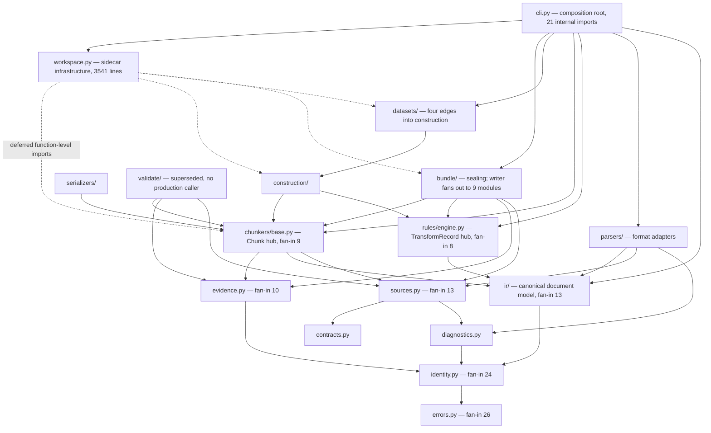
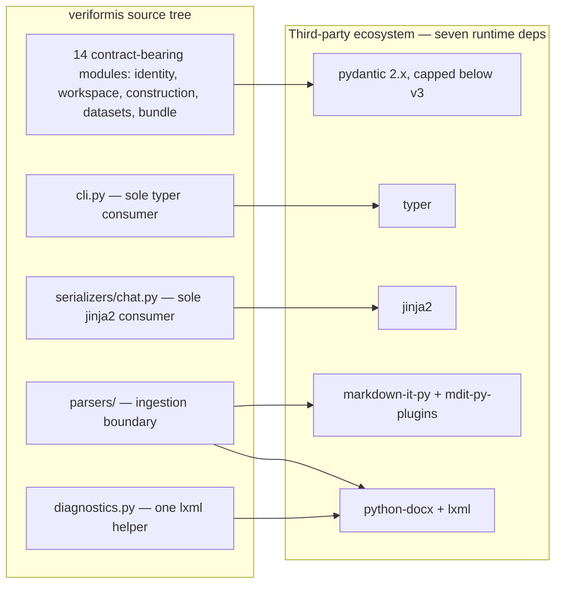

# Dependencies

How internal and external dependencies are managed: the fan-in kernel at the
bottom of the graph, the containment of third-party libraries at the edges,
the deferred-import idiom that keeps infrastructure acyclic, and the
versioning governance that pins it all down.

**Last reviewed:** 2026-08-06 after Group 9 + beta-prep on `main`

**Next review:** Any architecture or dependency change

The dependency architecture of Veriformis is organized as a strict,
downward-pointing directed acyclic graph of roughly nine layers, running from
a dependency-free foundation (`errors`, `contracts`) up through the canonical
model (`ir`, `sources`, `evidence`), the pipeline middle (`parsers`, `rules`,
`chunkers`, `construction`, `datasets`), the output stage (`serializers`,
`validate`, `bundle`), and finally the service surface (`workspace`, `cli`).
No lower layer imports a higher one, and every cross-package edge targets
either a layer below or a sibling within the same layer. This shape is not
enforced by tooling — no import-linter configuration exists in the repository
— but is instead maintained by a facade convention in which every subpackage
`__init__.py` re-exports its public API (for example
`src/veriformis/ir/__init__.py:1-14`), so consumers import packages rather
than deep modules. The consequence is a graph that can be audited by
inspection: a single `grep` over import statements reconstructs the entire
layering, and the figures in this document were produced exactly that way.

## The kernel: what fan-in actually means here

Two modules dominate the graph by fan-in. `errors.py` is imported by 26 of the
53 Python files under `src/veriformis` while itself importing nothing internal
— its only import is `from __future__ import annotations`
(`src/veriformis/errors.py:3`) — and it defines the exception taxonomy
(`ParseError`, `EvidenceError`, `GateFailure`, and siblings) that every layer
raises and catches. `identity.py` follows with 24 importers and depends only
on `errors` (`src/veriformis/identity.py:16`) plus pydantic
(`src/veriformis/identity.py:14`), which it uses solely to normalize pydantic
payloads into canonical JSON rather than to define models of its own
(`src/veriformis/identity.py:26-27`). A naive reading of these numbers — half
the codebase coupled to two files — overstates the risk. Both modules are
tiny (140 and 227 lines respectively), stable in purpose, and sit at the
bottom of the graph where the dependency direction makes change propagate
outward only through already-dependent callers. The genuine exposure is
subtler: `identity.py` derives the digests and durable IDs that are embedded
into every persisted artifact, so a behavioral change to its canonicalization
silently invalidates previously content-addressed data. The design's answer is
discipline rather than abstraction — these two files function as a frozen
kernel whose outputs are versioned through the persisted ID format itself
(`src/veriformis/identity.py:19`).

## External integration topology: containment as anti-corruption

The system declares exactly seven runtime dependencies (`pyproject.toml:20-28`),
and each one maps to a deliberately narrow consumer set. The format libraries
are confined to the ingestion edge with near-perfect discipline:
`markdown-it-py` and `mdit-py-plugins` appear only in
`src/veriformis/parsers/markdown.py:15-18`, `python-docx` only in
`src/veriformis/parsers/docx.py:29` and `src/veriformis/parsers/dispatch.py:7`,
and `lxml` only in those two parser modules plus one XML-validation helper in
`src/veriformis/diagnostics.py:17`. This is an anti-corruption layer in the
classic sense: format-specific objects are parsed into the canonical document
IR at the boundary, and no module above `parsers/` ever names a Markdown token
or a DOCX run. The impact is that format churn — a swapped Markdown engine, a
new input format — is absorbed entirely behind `parsers/dispatch.py`, which
routes by extension, leaving the nine-stage pipeline untouched. Two further
dependencies each have exactly one internal consumer: `typer` is imported only
by the CLI (`src/veriformis/cli.py:16`) and `jinja2` only by the chat
serializer (`src/veriformis/serializers/chat.py:7`), whose templates ship as
package data (`pyproject.toml:46-47`). Presentation frameworks therefore carry
zero architectural gravity: replacing either costs one file.

## Pydantic: a deliberate core-domain dependency

The one pervasive external dependency is pydantic, present in 14 files — but
its placement is the point. Every occurrence sits on a module that defines a
strict, versioned, on-disk contract: workspace revisions
(`src/veriformis/workspace.py:18`), construction models and evidence, all six
dataset modules, and the bundle manifest and attestation layer. The persisted
JSON these models validate is content-addressed and sealed, so schema
validation is not an implementation detail but part of the product's
verification guarantee; choosing a validation framework here is a domain
decision, not framework lock-in in the pejorative sense. The risk profile is
nonetheless real and singular: the declared bound `pydantic>=2.10,<3`
(`pyproject.toml:25`, locked at 2.13.4 in `uv.lock`) means a future pydantic
v3 is the only external upgrade with project-wide blast radius. Two
mitigations are already structural. First, pydantic never leaks into the
pipeline's data currency — the `Chunk`, `TransformRecord`, and IR node types
that flow between stages are plain dataclasses
(`src/veriformis/chunkers/base.py`, `src/veriformis/rules/engine.py`), so the
runtime pipeline is framework-free. Second, the kernel modules are effectively
stdlib-only, so even a catastrophic pydantic migration leaves digests,
identities, and the error taxonomy intact.

## Composition, deferred imports, and cycle posture

Cross-layer wiring is concentrated in exactly one place. `cli.py` (1939 lines)
imports 21 internal modules spanning every layer except `serializers` and
`validate` (`src/veriformis/cli.py:18-141`), and is the only module that
imports across more than two layers — a composition root in the literal
sense. The [architecture hub](../architecture.md) states the same boundary:
the CLI remains the composition root until a surface-neutral `PipelineService`
arrives (**planned**, Group 4; see
`docs/plans/2026-07-29-veriformis-roadmap.md`). Notably, the design achieves
this without classical dependency inversion: there are no protocols, abstract
ports, or injection containers. Instead, inversion of control falls out of two
simpler decisions — all wiring lives in one file, and the contracts passed
between stages are stable, low-level data types rather than interfaces. The
infrastructure seam demonstrates the payoff: `workspace.py`, at 3541 lines the
largest module, is imported within the source tree only by `cli.py`
(`src/veriformis/cli.py:135`) and keeps its module-level imports to just
`contracts`, `errors`, and `identity` (`src/veriformis/workspace.py:26,35,48`),
so the entire content-addressed storage layer is severable without untangling.

That narrowness comes with a caveat the static graph hides. `workspace.py`
reaches back up into the domain pipeline through function-level deferred
imports — `chunkers.base`, `construction`, `rules.engine`, and `sources`
inside one loader (`src/veriformis/workspace.py:2339-2348`), `datasets` and
`bundle` at `src/veriformis/workspace.py:2467` and `:2688`, and the full
parse-and-clean replay set at `src/veriformis/workspace.py:3007-3028` and
`:3408-3412`. `bundle/verifier.py` applies the same idiom for `construction`
and `datasets` types (`src/veriformis/bundle/verifier.py:389-390,483-485`).
The pattern serves two purposes: it keeps the module-load graph acyclic and
import cheap — the 3.5k-line infrastructure module loads without dragging in
the entire pipeline — and it structurally prevents any future cycle between
infrastructure and domain, since the edge materializes only at call time. The
cost is real but bounded: static analysis, including the fan-in figures above,
understates runtime coupling, and an import linter would see none of these
edges.

The graph's only true cycle is intra-package and load-order-dependent:
`ir/__init__.py` imports `nodes` first (`src/veriformis/ir/__init__.py:1`) and
then `serde` (`src/veriformis/ir/__init__.py:9`), while `serde` imports its
own package back (`src/veriformis/ir/serde.py:10`). It works only because the
partially initialized package already carries the `nodes` attribute when
`serde` loads; reordering the facade's imports breaks it. Replacing the
package-level import with a direct `veriformis.ir.nodes` import would remove
the sole cycle outright, and is the cheapest hygiene improvement the graph
offers.

A related governance finding concerns `validate/gates.py`. Dependency
inspection shows it is imported inside the source tree only by its own facade
(`src/veriformis/validate/__init__.py:1`), and its `run_gates`
(`src/veriformis/validate/gates.py:114-122`) implements just five gates — yet
the seal path performs exact 17-gate snapshot validation (see
`docs/architecture.md`). The resolution is supersession, not a correctness
hole: the live seventeen-gate machinery, registered in
`V1_FINISHED_DATASET_GATES` (`src/veriformis/contracts.py:114-132`), lives in
`datasets/validation.py`, whose docstring states that only a report whose
seventeen gates pass can be sealed
(`src/veriformis/datasets/validation.py:6-7`), and it is this machinery that
the production `validate` command invokes (`src/veriformis/cli.py:1544,1554`).
Similarly, `bundle/writer.write_bundle` (`src/veriformis/bundle/writer.py:150`)
consumes precomputed gate results as a parameter and refuses to seal on any
failure (`src/veriformis/bundle/writer.py:161-167`) but has no production
caller. The legacy pair is superseded yet still re-exported, which actively
misleads readers of the dependency graph; deletion or an explicit legacy
marker would restore the graph's documentary value.

## Versioning and governance posture

Dependency governance follows a reproducibility-first model. The `uv.lock`
file is committed and pins the full closure of 64 packages, while
`pyproject.toml` declares floor-only bounds for six of the seven runtime
dependencies, reserving a hard upper cap for the one dependency whose major
version would invalidate persisted contracts (`pyproject.toml:25`). Tooling is
pinned more aggressively than libraries — ruff is held at exactly `==0.16.0`
in both the test extras and the tool configuration (`pyproject.toml:31,50`) —
reflecting a judgment that lint drift breaks builds more often than library
minors break behavior. Taken as a whole, the dependency strategy is
conservative in the right places: a frozen two-module kernel, format
volatility quarantined at the ingestion boundary, framework gravity confined
to persistence contracts and single-consumer edges, and exactly one
deferred-import idiom traded against static visibility. The principal residual
risks are the pydantic major-version ceiling, the load-order-fragile `ir`
cycle, and the superseded `validate` package — all three visible directly
from the graph, which is itself evidence that the layering discipline is
working.

## Related documentation

- [Architecture overview](README.md)
- [Layers](layers.md) — the layer stack this graph flattens into fan-in terms
- [Data flow](data-flow.md) — the runtime coupling the static graph hides
- [Entry points](entry-points.md) — the composition root described above, in
  invocation terms
- [Architecture hub](../architecture.md)
