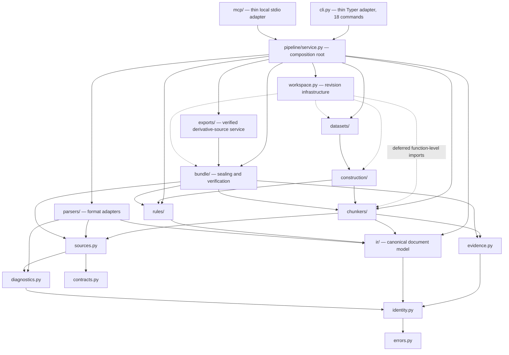
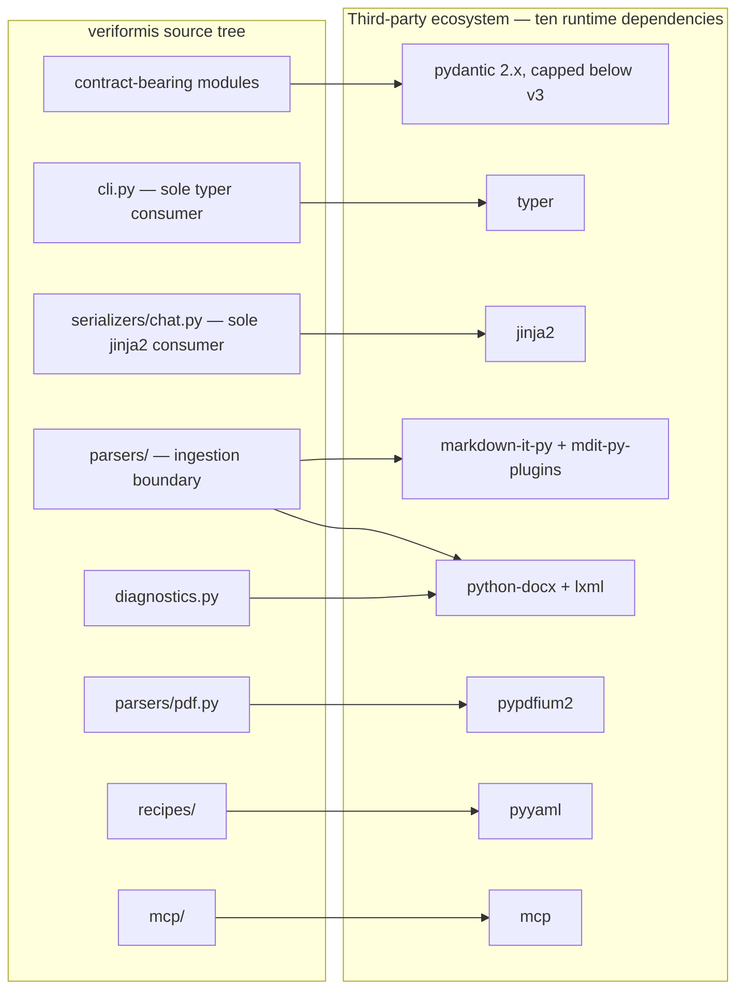

# Dependencies

How internal and external dependencies are managed: the fan-in kernel at the
bottom of the graph, the containment of third-party libraries at the edges,
the deferred-import idiom that keeps infrastructure acyclic, and the
versioning governance that pins it all down.

**Last reviewed:** 2026-08-21 (Phase 4.1 export-service reconciliation)

**Next review:** Any architecture or dependency change

The dependency architecture of Veriformis is organized as a strict,
downward-pointing directed acyclic graph. It runs from a dependency-light
foundation (`errors`, `contracts`, `identity`) through the canonical model and
pipeline domains (`ir`, `sources`, `evidence`, `parsers`, `rules`, `chunkers`,
`construction`, `datasets`, `bundle`) through `exports.ExportService` to the
`PipelineService` composition root. `exports/` depends on the bundle verifier
but is not a tenth workspace stage. CLI and MCP are adapters over the pipeline
root; recipes and the optional Aptus handoff are bounded integration modules.
The SwiftUI workbench is outside the Python graph and shells the CLI.
No lower layer imports a higher one, and every cross-package edge targets
either a layer below or a sibling within the same layer. This shape is not
enforced by tooling — no import-linter configuration exists in the repository
— but is instead maintained by a facade convention in which every subpackage
`__init__.py` re-exports its public API. The composition service intentionally
imports deeper implementations because it is the one place where stage layers
are assembled. The consequence is a graph that remains auditable by source
inspection without making interface adapters own domain policy.

## The kernel: what fan-in actually means here

`errors.py`, `contracts.py`, and `identity.py` have broad fan-in because they
define the shared error taxonomy, persisted registries, canonical JSON,
digests, and durable identities. They sit at the bottom of the graph and do not
import pipeline domains. The genuine exposure is semantic rather than numeric:
a behavioral change to canonicalization can invalidate persisted
content-addressed data. The design's answer is versioned schema and identity
formats plus strict load-time recomputation, not a frequently changing
abstraction layer.

## External integration topology: containment as anti-corruption

The system declares exactly ten runtime dependencies in `pyproject.toml`.
Seven are bounded adapters: markdown-it-py and mdit-py-plugins support
Markdown; python-docx and lxml support DOCX and XML validation; pypdfium2
supports digitally-born PDF; PyYAML loads versioned pipeline recipes; and MCP
implements the local stdio surface. Typer is confined to the CLI and jinja2 to
the retained chat renderer. Pydantic is the one deliberate cross-cutting
dependency because it validates versioned persisted contracts. Format-specific
objects are converted into canonical IR at the parser boundary, so the rest of
the nine-stage pipeline is not coupled to a Markdown token, DOCX run, PDF page,
or structured-input parser object.

## Pydantic: a deliberate core-domain dependency

The one pervasive external dependency is pydantic, and its placement is the
point. Its occurrences sit on modules that define a
strict, versioned, on-disk contract: workspace revisions
(`src/veriformis/workspace.py:18`), construction models and evidence, all six
dataset modules, and the bundle manifest and attestation layer. The persisted
JSON these models validate is content-addressed and sealed, so schema
validation is not an implementation detail but part of the product's
verification guarantee; choosing a validation framework here is a domain
decision, not framework lock-in in the pejorative sense. The risk profile is
nonetheless real and singular: the declared bound `pydantic>=2.10,<3`
(`pyproject.toml`) means a future pydantic
v3 is the only external upgrade with project-wide blast radius. Two
mitigations are already structural. First, pydantic never leaks into the
pipeline's data currency — the `Chunk`, `TransformRecord`, and IR node types
that flow between stages are plain dataclasses
(`src/veriformis/chunkers/base.py`, `src/veriformis/rules/engine.py`), so the
runtime pipeline is framework-free. Second, the kernel modules are effectively
stdlib-only, so even a catastrophic pydantic migration leaves digests,
identities, and the error taxonomy intact.

## Composition, deferred imports, and cycle posture

Cross-layer wiring is concentrated in `pipeline/service.py`, the implemented
surface-neutral composition root. Its methods own stage policy, verified input
loading, deterministic domain calls, and workspace transactions. It now also
injects and owns `exports.ExportService`, whose Phase 4.1 dependency points
only to the bundle facade. That service calls the descriptor-anchored finished-
bundle inspector and returns the immutable semantic result; it does not add a
workspace dependency or persisted pydantic contract. `cli.py` and
`mcp/server.py` translate their respective protocols into pipeline methods;
the SwiftUI workbench shells the CLI. No adapter exposes export operations yet.
This arrangement needs no dependency injection container because the contracts
passed between stages are stable, low-level data values. `workspace.py` keeps
its module-level domain coupling narrow and uses function-level imports for
semantic replay, so service and workspace orchestration do not create a
module-load cycle.

That narrowness comes with a caveat the static graph hides. `workspace.py`
reaches back up into the domain pipeline through function-level deferred
imports — `chunkers.base`, `construction`, `rules.engine`, and `sources`
inside one loader (`src/veriformis/workspace.py:2339-2348`), `datasets` and
`bundle` at `src/veriformis/workspace.py:2467` and `:2688`, and the full
parse-and-clean replay set at `src/veriformis/workspace.py:3007-3028` and
`:3408-3412`. `bundle/verifier.py` still defers construction replay imports,
but Phase 4.1 intentionally imports `RowSet` and `DatasetValidationReport` at
module load so the public `VerifiedFinishedBundle` type is introspectable.
Those are downward edges and neither target module imports `bundle`, so the
graph remains acyclic. The deferred-import pattern keeps the workspace kernel
cheap and structurally prevents cycles between infrastructure and domain; the
verifier's narrow public-type edge is not required to share that kernel-only
constraint. The
cost is real but bounded: static analysis, including the fan-in figures above,
understates runtime coupling, and an import linter would see none of these
edges.

The graph's only true cycle is intra-package and load-order-dependent:
`ir/__init__.py` imports `nodes` first (`src/veriformis/ir/__init__.py:1`) and
then `serde` (`src/veriformis/ir/__init__.py:9`), while `serde` imports its
own package back (`src/veriformis/ir/serde.py:10`). It works only because the
partially initialized package already carries the `nodes` attribute when
`serde` loads; reordering the facade's imports breaks it. Replacing the
package-level import with a direct `veriformis.ir.nodes` import would remove
the sole cycle outright, and is the cheapest hygiene improvement the graph
offers.

A related governance finding concerns `validate/gates.py`. Dependency
inspection shows it is imported inside the source tree only by its own facade
(`src/veriformis/validate/__init__.py:1`), and its `run_gates`
(`src/veriformis/validate/gates.py:114-122`) implements just five gates — yet
the seal path performs exact 17-gate snapshot validation (see
`docs/architecture.md`). The resolution is supersession, not a correctness
hole: the live seventeen-gate machinery, registered in
`V1_FINISHED_DATASET_GATES` (`src/veriformis/contracts.py:114-132`), lives in
`datasets/validation.py`, whose docstring states that only a report whose
seventeen gates pass can be sealed
(`src/veriformis/datasets/validation.py:6-7`), and it is this machinery that
`PipelineService.validate` invokes.
Similarly, `bundle/writer.write_bundle` (`src/veriformis/bundle/writer.py:150`)
consumes precomputed gate results as a parameter and refuses to seal on any
failure (`src/veriformis/bundle/writer.py:161-167`) but has no production
caller. The legacy pair is superseded yet still re-exported, which actively
misleads readers of the dependency graph; deletion or an explicit legacy
marker would restore the graph's documentary value.

## Versioning and governance posture

Dependency governance follows a reproducibility-first model. The `uv.lock`
file is committed and pins the complete resolved dependency closure, while
`pyproject.toml` declares compatible floors for runtime dependencies and
reserves a hard upper cap for pydantic, whose next major version could affect
persisted-contract validation. Tooling is
pinned more aggressively than libraries — ruff is held at exactly `==0.16.0`
in both the test extras and the tool configuration (`pyproject.toml`) —
reflecting a judgment that lint drift breaks builds more often than library
minors break behavior. Taken as a whole, the dependency strategy is
conservative in the right places: a frozen two-module kernel, format
volatility quarantined at the ingestion boundary, framework gravity confined
to persistence contracts and single-consumer edges, and exactly one
deferred-import idiom traded against static visibility. The principal residual
risks are the pydantic major-version ceiling, the load-order-fragile `ir`
cycle, and the superseded `validate` package — all three visible directly
from the graph, which is itself evidence that the layering discipline is
working.

## Related documentation

- [Architecture overview](README.md)
- [Layers](layers.md) — the layer stack this graph flattens into fan-in terms
- [Data flow](data-flow.md) — the runtime coupling the static graph hides
- [Entry points](entry-points.md) — the composition root described above, in
  invocation terms
- [Architecture hub](../architecture.md)
