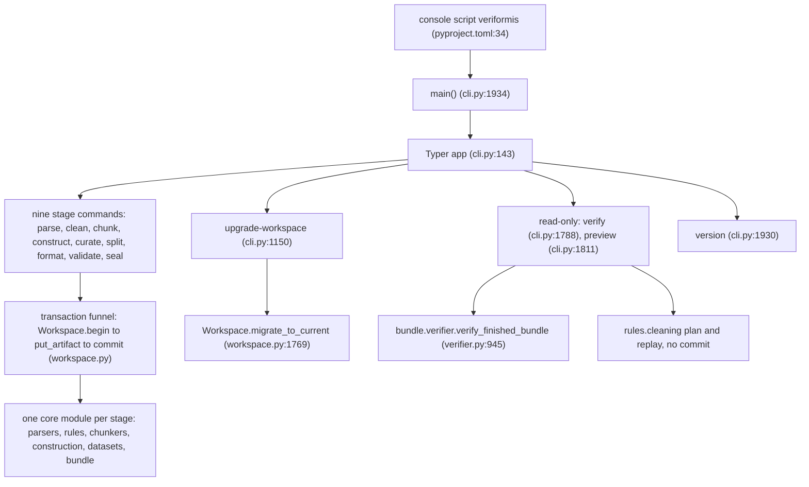
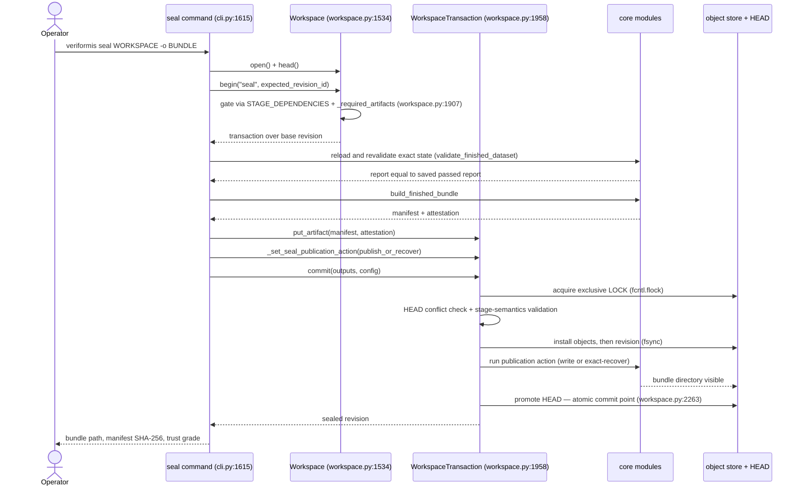

# Entry points

How invocation reaches the system: the single CLI surface and its thirteen
commands, the stage-gated transaction template every mutating command
executes, the seal path that couples a workspace receipt to a published
artifact, and the deliberately independent verification entry point.

**Last reviewed:** 2026-08-05 after Group 4 completion

**Next review:** The first Group 5 input or recipe change

## Two surfaces, one orchestration root

The system exposes two invocation surfaces that share one orchestration root.
The installed console script maps `veriformis` to `veriformis.cli:main`
(`pyproject.toml`); the CLI translates arguments, messages, and exit codes
only. Typed programmatic callers use
`veriformis.pipeline.PipelineService`, which owns stage policy and workspace
transactions. There is no package `__main__.py`, so `python -m veriformis` is
unsupported, and the top-level package still exports only `__version__`.
Every mutating stage still becomes visible through one atomic workspace
`HEAD` transition; the difference after Group 4 is that the transactional
discipline lives in the service, not in Typer command bodies.

## The command surface: thirteen commands, four roles

The thirteen subcommands registered on the one `typer.Typer` application
(`src/veriformis/cli.py:143`) fall into four functional roles rather than
thirteen peers. Nine stage commands — parse (`src/veriformis/cli.py:821`),
clean (957), chunk (1062), construct (1169), curate (1295), split (1409),
format (1460), validate (1544), and seal (1615) — map one-to-one onto the nine
workspace stages enumerated in `STAGES` (`src/veriformis/workspace.py:114-124`),
and each command's name doubles as the stage key it passes to
`Workspace.begin`. A maintenance command, upgrade-workspace
(`src/veriformis/cli.py:1150`), funnels into `Workspace.migrate_to_current`
(`src/veriformis/workspace.py:1769`) to advance legacy revision schemas
stepwise. Two read-only commands, verify (`src/veriformis/cli.py:1788`) and
preview (1811), inspect artifacts without committing state, and a meta
command, version (1929-1931), surfaces the package version. Because command
names are stage keys, the pipeline order is legible from the command list
alone; yet ordering is not enforced by the CLI at all — it is enforced by the
workspace's dependency table `STAGE_DEPENDENCIES`
(`src/veriformis/workspace.py:138-165`), which the stage commands merely
trigger. This separation keeps the CLI thin in authority even where it is
thick in code.

## The stage-gated transaction template

Every mutating command executes the same stage-gated transactional template,
which constitutes the system's real request-processing pipeline. The handler
opens or creates the workspace (`Workspace.create` / `Workspace.open`,
`src/veriformis/workspace.py:1552, 1613`), reads the committed head revision,
and may short-circuit when the stage is already complete under an identical
configuration, as clean does (`src/veriformis/cli.py:967-974`). It then enters
`Workspace.begin(stage)` (`src/veriformis/workspace.py:1737-1767`), which
validates that the stage exists for the revision's schema version and that
every dependency stage is complete and unstale via `_required_artifacts`
(`src/veriformis/workspace.py:1907-1928`). Inside the transaction the command
reloads and re-verifies every upstream artifact from the committed base
revision — the `_load_sources`, `_load_documents`, and `_load_chunks` helpers
re-run parsers and cleaning replays against the persisted bytes and raise
`EvidenceError` on any mismatch (`src/veriformis/cli.py:330-625`) — before
computing its own result deterministically in exactly one core module per
stage: parse dispatches by extension through `parse_captured_source`
(`src/veriformis/parsers/dispatch.py:31-79`), chunk to `build_chunks`,
construct to `construct_dataset`, format to `serialize_dataset`, and validate
to `validate_finished_dataset`. Results are staged as content-addressed
artifacts carrying producer and config provenance through
`WorkspaceTransaction.put_artifact` (`src/veriformis/workspace.py:2017-2051`),
and a single atomic `commit` makes the stage visible. The wiring is static:
cli.py imports curated symbol sets from the subpackage facades
(`src/veriformis/cli.py:19-26, 37-50, 60-82, 106-111`), and the only dispatch
table in the layer is `_STRATEGIES`, which maps chunk-strategy names to five
strategy functions (`src/veriformis/cli.py:146-152`). Keeping the core modules
as pure functions over verified inputs is what allows every stage to be
replayed and compared byte-for-byte; the observable trade-off is that
orchestration concerns such as provenance metadata and recovery policy
accumulate in the CLI layer rather than in the stage modules.

The transaction machinery beneath this template provides optimistic
concurrency and atomic visibility. `begin` snapshots the base revision
(`src/veriformis/workspace.py:1747-1767`); `commit` then acquires an exclusive
`fcntl.flock` on the workspace LOCK file (`src/veriformis/workspace.py:2126,
1930-1951`), re-reads HEAD, and raises `WorkspaceRevisionConflict` if it moved
(`src/veriformis/workspace.py:2128-2131`). After validating cross-artifact
stage semantics, the commit installs new objects, then the revision directory,
and only then promotes HEAD — an ordering the implementation explicitly
designates as the commit point, after which no fallible work may run
(`src/veriformis/workspace.py:2255-2278`). A commit that changes a stage also
marks every descendant stage stale (`src/veriformis/workspace.py:2202-2211`),
which is how re-running parse invalidates the entire downstream pipeline,
while an exactly identical commit is detected as a no-op and returns the
existing revision untouched (`src/veriformis/workspace.py:2196-2200,
2237-2253`), giving stages idempotency beyond the CLI's own config-equality
short-circuits.

## The seal path

The seal path is the most consequential call chain, because it couples a
workspace-internal receipt to an externally visible artifact. The command
re-runs the full `validate_finished_dataset` inside the transaction and
refuses to proceed unless the result equals the persisted passing report
byte-for-byte (`src/veriformis/cli.py:1632-1649`), so sealing is bound to an
exact validated state rather than to a plausible one. It then builds the
manifest and attestation through `build_finished_bundle`
(`src/veriformis/cli.py:1673`), stages both as workspace artifacts, and
registers a publication callback through the deliberately narrow hook
`_set_seal_publication_action`, which the transaction accepts only from the
seal stage (`src/veriformis/workspace.py:2053-2072`). During commit, that
callback runs under the exclusive lock after the candidate revision is fully
installed and immediately before HEAD promotion
(`src/veriformis/workspace.py:2255-2266`), which orders the externally visible
bundle ahead of the internal receipt; a crash between the two is handled on
retry by `_recover_exact_finished_bundle`, which adopts a prior publication
only after independently verifying it and comparing every expected byte
(`src/veriformis/cli.py:211-288`). The design accepts a small window of
external visibility without a receipt in exchange for never publishing an
unverified bundle, and it contains that policy entirely within the seal stage.

## The independent verify path

Against this workspace-centric flow, verify forms a second, deliberately
independent entry point. The command never calls `Workspace.open`; it takes a
sealed bundle directory, optionally pinned to an expected manifest digest, and
delegates entirely to `verify_finished_bundle`
(`src/veriformis/bundle/verifier.py:945`), reporting a trust grade, bundle
identity, and declared row count (`src/veriformis/cli.py:1787-1807`). Even its
import of the verifier is local to the function body
(`src/veriformis/cli.py:1793`), keeping the consumer path decoupled from the
producer wiring. The rationale is a trust-boundary argument: a downstream
consumer must be able to re-check a bundle's integrity without access to, or
trust in, the producing workspace, so verification depends only on the
bundle's self-contained manifest and attestation. The reported grade states
the evidence limit: `self_consistent` proves internal agreement only, while
`external_digest` requires the expected manifest digest to arrive through a
separate trusted channel. Preview occupies a third, read-only position: its
raw-file branch reuses `parse_captured_source` plus `plan_cleaning` and
`replay_cleaning_plan` to show what clean would commit
(`src/veriformis/cli.py:1877-1901`), and its workspace branch replays the
persisted durable plan when one matches the requested configuration
(`src/veriformis/cli.py:1826-1876`). Because preview re-implements the
parse-and-plan calls rather than sharing a helper with the committing
commands, the read-only path carries a documented drift risk against the
committing path.

Below the CLI, the system's programmatic seams are implicit rather than
contractual. The subpackage facade `__init__.py` files re-export curated
symbol sets — for example the bundle facade re-exports
`build_finished_bundle`, `write_finished_bundle`, and
`verify_finished_bundle` (`src/veriformis/bundle/__init__.py:2-18`), with
parallel facades for construction, datasets, and ir — and both the CLI and
the test suite import these sets directly, making the facades the de-facto
library API in the absence of a formal one. That the test suite drives the
application through `typer.testing.CliRunner` confirms that `cli.app` is
treated as the primary public surface. Notably, the shared error module's
docstring describes its typed errors as shared by every surface, naming "CLI,
MCP, GUI" (`src/veriformis/errors.py:1`), which records an architectural
anticipation of future frontends (**planned**, not implemented) that the
current single-surface design does not yet realize.

## Error funnel and exit semantics

Error handling closes the boundary loop with a uniform funnel. Every stage
raises typed errors rooted at `VeriformisError`, each carrying a stable
machine-readable `code` (`src/veriformis/errors.py:6-140`), and each command
wraps its body in a `try/except` over `(VeriformisError, EvidenceError,
OSError, UnicodeError, ValueError)` — extended with `TypeError` or `re.error`
where the stage warrants — and delegates to `_echo_error`, which prints
`error[code]: message` to stderr and raises `typer.Exit`
(`src/veriformis/cli.py:198-202`). Exit semantics distinguish failure classes:
input and evidence errors exit with status 2 by default
(`src/veriformis/cli.py:950-951`), while validate, seal, and verify exit with
status 1 (`src/veriformis/cli.py:1602, 1774, 1801`), and validate additionally
exits 1 after a successful commit whenever the gate report did not pass
(`src/veriformis/cli.py:1589-1593, 1610-1611`), so a recorded-but-failed
validation is still a failing invocation. Two refinements keep failures honest
at the boundary: seal warns explicitly when a published bundle remains visible
although the workspace receipt did not commit
(`src/veriformis/cli.py:1767-1773`), and commit-durability doubts are
downgraded to non-fatal stderr warnings rather than masked or fatal
(`src/veriformis/cli.py:205-208`). Because a transaction's `__exit__` aborts
and removes its staging directory on any exception
(`src/veriformis/workspace.py:1982-1984, 2094-2097`), errors propagate to the
surface without ever leaving partial state behind — the property that makes
the CLI's simple catch-and-report strategy sufficient.

## Related documentation

- [Architecture overview](README.md)
- [Layers](layers.md) — the modules each command drives
- [Dependencies](dependencies.md) — the composition root in graph terms
- [Data flow](data-flow.md) — what the transactions move
- [Architecture hub](../architecture.md) — stage graph and workspace layout
- [CLI reference](../cli.md) — command options and failure boundaries
