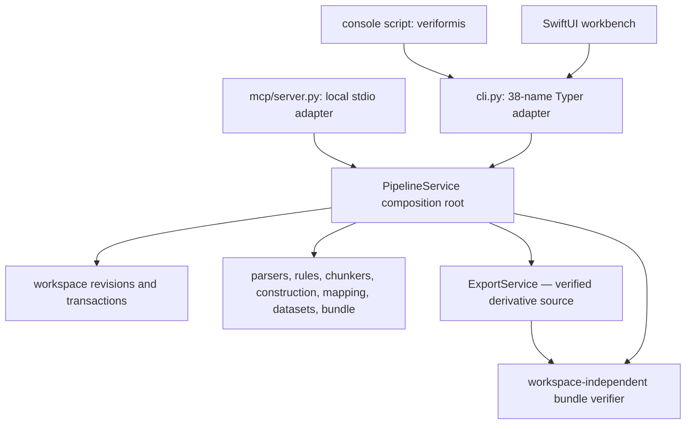
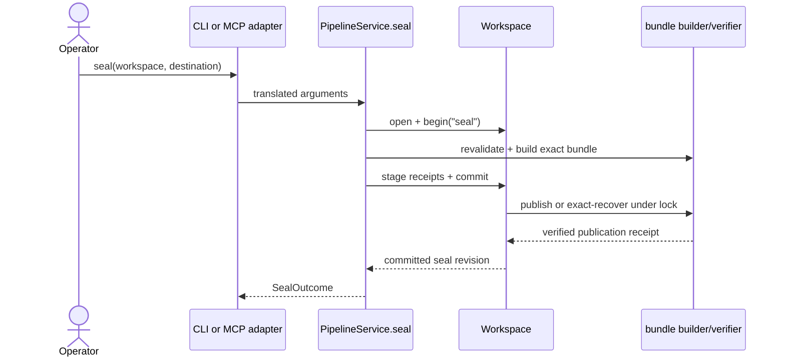

# Entry points

How invocation reaches Veriformis through one surface-neutral orchestration
root, with CLI, MCP, Python, and macOS adapters kept outside stage policy.

**Last reviewed:** 2026-09-02 (post-20 remainder honesty)

**Next review:** Any entry-point or architecture change

## Multiple adapters, one orchestration root

`veriformis.pipeline.PipelineService` owns stage policy, verified artifact
loading, workspace transactions, sealing, independent verification, and
read-only preview behavior. It also injects and owns the consumer-neutral
`exports.ExportService`; adapters reach its Phase 4.8 operations only through
typed `PipelineService` methods and never call or reimplement it directly.

| Surface | How it enters |
| --- | --- |
| Python API | Call `PipelineService` methods directly |
| CLI | Console script `veriformis` → thin Typer adapter |
| MCP | `veriformis mcp` → local stdio tools over the same service |
| macOS workbench | SwiftUI app builds and runs `veriformis` CLI commands (ADR-0019 process adapter; `veriformis.workbench-adapter/v1` names wraps, loading is not a screen) |

There is no package `__main__.py`, so `python -m veriformis` is unsupported.
Every mutating stage becomes visible through one atomic workspace `HEAD`
transition regardless of the adapter that initiated it.

## CLI command surface

The CLI exposes 53 root names (52 `@app.command` entries plus the `export`
Typer group). Ten names are workspace stages: `parse`, `clean`, `chunk`,
`construct`, `map`, `curate`, `split`, `format`, `validate`, and `seal`.
Document-source uses nine of them (no `map`). Dataset-row uses `parse`,
`map`, then `curate` through `seal`. The remaining commands are
`upgrade-workspace`, `verify`, `preview`, `package`, `package-verify`,
`taxonomy`, `goals`, `presets`, `modes`, `mapping-contracts`,
`mapping-templates`, `mapping-detect`, `mapping-preview`,
`mapping-rejections`, `profile-admissions`, `candidate-profile-admissions`, `columnar-schemas`, `collect`, `ocr-preview`, `preflight`, `goal-preview`, `quality-report`,
the `export` group with four subcommands, `export-verify`, `run`,
`list-recipes`, `mcp`, `handoff`, `handoff-verify`, and `version`. Ordering
is enforced by the workspace dependency table, not by Typer.

## Stage transaction template

Each mutating `PipelineService` method opens or creates a workspace, checks the
current revision and stage dependencies, loads and re-verifies upstream
artifacts, calls the deterministic domain implementation, stages
content-addressed outputs, and commits once. `Workspace.begin(stage)` rejects
missing or stale dependencies. Commit rechecks `HEAD` under an exclusive lock,
validates cross-artifact semantics, installs objects and the immutable revision,
then atomically promotes `HEAD`. A changed base raises
`workspace-revision-conflict`; a changed stage invalidates its descendants.

The service owns `_load_sources`, `_load_documents`, `_load_chunks`, and the
other replay helpers. CLI and MCP therefore translate inputs and outcomes but
do not reimplement parse, mapping, construction, split, validation, or recovery policy.

## Seal and independent verification

`PipelineService.seal` reloads the current validated state, rebuilds the
validation report, and requires exact equality with the saved passing report.
It builds the manifest and attestation, stages them as workspace receipts, and
registers the narrow seal publication action on the transaction. Publication
writes and verifies a temporary closed bundle before atomic promotion. If an
exact bundle became visible before its receipt committed, retry recovery adopts
it only after external-digest verification and byte-for-byte comparison.

`PipelineService.verify` deliberately does not open a workspace. It passes only
the sealed directory and optional expected manifest digest to
`verify_finished_bundle`. `self_consistent` proves internal agreement;
`external_digest` additionally requires a matching digest from a separate
trusted channel. The optional Aptus handoff is a separate adapter artifact and
is not required for core bundle verification.

## Phase 4 export foundation and Phase 5 generic implementations

`PipelineService.export_service` exposes the injected `ExportService` to
Python composition. Its `verified_source` method calls
`inspect_finished_bundle`, which returns an immutable
`VerifiedFinishedBundle` containing the manifest, validation report,
reconstructed row set, and existing verification result from the same
descriptor-anchored pass. The ordinary `verify_finished_bundle` return type is
unchanged. Export-source admission defaults to `require_external_digest`; a
caller must explicitly request `allow_self_consistent` to proceed without a
retained expected digest. Any supplied digest remains authoritative and a
mismatch never downgrades to self-consistent trust.

The service's read-only `create_plan` method performs that admission once and
derives every source, objective, row, split, and source-membership-baseline fact
from the returned immutable view. Beyond the bundle locator and trust-admission
inputs, Python callers provide only a strict container profile, optional
consumer profile, dependency bindings, and output file plans. They cannot
provide membership, filtering, resplitting, destination root, or publication
arguments.

`ExportService.validate_derivative_membership` is also Python-composition-only.
It accepts one strict plan, normalized logical train rows, normalized logical
evaluation rows, and their aligned provenance. It fresh-reconstructs the
candidate row set and complete projection and succeeds only when both equal the
plan baseline. Its signature contains no selection, mutation, destination,
overwrite, writer, or publication control.

`ExportService.publish` is the Python-composition-only publication boundary. Its
existing arguments accept a strict exact-byte or semantic-content plan, source
bundle locator, destination root, separately retained source digest when
required, and optional cancellation callback. It exposes no renderer/replayer
selection, overwrite, filtering, or membership controls. Private
implementations supply bytes and normalized candidates. Phase 4's default
service failed closed because no renderer or semantic replayer was installed;
Phase 5.1–5.3 install only the reviewed exact-byte `split-jsonl-directory`,
canonical `json`, and `constrained-csv` v1 renderers.

Publication re-verifies source and plan, invokes the renderer twice from
independent strict inputs, and repeats complete membership validation. Exact
profiles require identical normalized byte trees. Semantic-only profiles permit
different physical bytes but require equal versioned canonical preimages and
membership from private replay; the service computes their digests and replays
descriptor-reread staged bytes before one atomic no-replace promotion. The call
signature and ten persisted v1 schemas remain unchanged.

Phase 4.8 adds five typed operations through `PipelineService`: executable-
profile discovery, destination-free dry run, self-described physical
inspection, operator-confirmed execution, and source-bound verification. A
private exact-selector catalog owns planners, renderers, and semantic
replayers. Its production instance was empty at Phase 4 closeout; tests alone
injected the conformance implementation. Phase 5.1–5.3 add the first production
entries, `split-jsonl-directory`, canonical `json`, and `constrained-csv` v1,
with no consumer profile and no semantic replayer.

Phase 5.4, merged as PR #56 at
`499d61fa2e7dd12edb5808c6bd9d0e0ab6b738c8`, extends the existing `package`
and `package-verify` commands without adding a root command. Exactly one
`--manifest-sha256` or `--export-receipt-sha256` selects the legacy bundle or
new export-pack transport profile; both or neither fail. The export-pack form
packages one unchanged directory as `.vfexport.zip` after validating the
separately retained canonical receipt digest. It is a Python/CLI transport
surface, not an `export` subcommand, MCP tool, or Mac UI action.

`veriformis export discover`, `export dry-run`, `export inspect`,
`export execute`, and top-level `export-verify` are thin adapters. The latter
four take one strict canonical request through `--request-json`.
`--request-json` takes the canonical request JSON text. It does not read a
filesystem path. To use a file, pass `--request-json "$(cat FILE)"`. The Mac
bridge already passes that JSON text, not a path. Historical request v1
remains unchanged and selects the split-JSONL defaults, canonical
JSON's fixed tree, or constrained CSV's fixed tree. Dry run, execute, and
source-bound verify also accept request v2 for split JSONL only, whose complete
canonical
`veriformis.split-jsonl-options/v1` object may change only the two safe stems or
omit provenance; inspect remains request v1. MCP exposes the same five
operations and canonical response envelope. The Mac bridge shells those CLI
commands, decodes stdout separately from diagnostics, and does not enumerate,
rewrite, or verify destination files itself. No surface accepts a plan,
profile, renderer, replayer, membership projection, replacement mode, or force
flag. Python callers import the cancellation callback, frozen publication
outcome, and visible-partial exception from `veriformis.exports`; publication
hooks remain private.

Phase 5.6 changes only the product dry-run response. `PipelineService`, CLI,
MCP, and the CLI-backed Mac bridge emit canonical
`veriformis.export-surface-response/v2` with result exactly `plan` and
`preview`; other operations retain response v1. The exported legacy Python
`export_dry_run_response(plan)` serializer remains an explicit plan-only v1
compatibility helper and is not used by those product operation adapters.
`veriformis.export-dry-run-preview/v1` carries ordinal-zero samples for each
non-empty partition and a sorted relative plan-derived tree plus receipt.
Payload objects are complete through 65,536 canonical bytes, or null with an
exact over-limit or response-budget omission reason; ASCII-safe wire escapes
decode to unchanged values. The
adapter path introduces no new operation, renderer selection, destination
argument, filesystem policy, MCP tool, or Mac UI action.

Phase 5.1's exact-byte renderer emits canonical payload-only partition JSONL,
deterministic README and data-card sidecars, optional aligned provenance, and a
receipt. Phase 5.2 emits one explicit split/schema-bearing canonical dataset
object, mandatory separately aligned provenance, deterministic README, and the
same receipt. Phase 5.3 emits fixed fully quoted train/evaluation CSV, a data
card, mandatory separately aligned provenance, deterministic README, and the
same receipt for the three flat row schemas. It refuses request v2 before
source access. After source admission reveals nested `messages`, it refuses the
schema before destination access with a JSON alternative. None
constructs, filters, reorders, curates, resplits, or changes partition
membership, and none makes a trainer-compatibility claim. The private
hooks remain trusted implementation code, not an untrusted plugin boundary;
semantic replay retains complete files in memory and its fixture is statically
bounded, but no production semantic replayer ships. Phase 4.9 remains the
historical consolidated adversarial closeout. Phase 5.4's merged
receipt-anchored transport leaves those renderer and surface claims unchanged.
Phase 5.5 likewise adds no entry point: its merged eleven-pair
ordinary-file reload matrix, three semantic-tamper cases, and constrained-CSV
`messages` refusal are test evidence only. Item 5.6 enriches existing dry run as
described above and merged as PR #58 at
`cd017941090c7352cb1d10f9a383042b954d4f2e`. Item 5.7 adds operator guidance
and closeout records only; it creates no entry point.

## Preview, recipes, and optional integrations

`PipelineService.preview` uses the same parse and cleaning plan/replay machinery
without committing state. `run` loads a versioned YAML pipeline and calls the
same service methods. MCP tools do likewise. The `handoff` and
`handoff-verify` commands expose the optional Aptus sibling descriptor; they do
not change the canonical six-file bundle or the stage dependency graph.

## Error funnel and exit semantics

Domain failures carry stable codes rooted at `VeriformisError`. The CLI's
shared `_run` and `_echo_error` helpers render them as
`error[code]: message`. Input and evidence failures normally exit 2;
`validate`, `seal`, and `verify` use exit 1. A valid but failing validation
report is committed for inspection and still exits 1. Partial publication is
surfaced explicitly through `SealPartialPublicationError`, and uncertain final
syncs are warnings rather than silent success claims.

Ordinary MCP stages serialize the same typed service outcomes as JSON. Export
MCP tools use the canonical export-surface envelope shared with the CLI. The
SwiftUI workbench records the generated CLI plan and process result, so it
inherits CLI exit and error semantics rather than implementing a second
pipeline.

## Related documentation

- [Architecture overview](README.md)
- [Layers](layers.md)
- [Dependencies](dependencies.md)
- [Data flow](data-flow.md)
- [Architecture hub](../architecture.md)
- [CLI reference](../cli.md)
- [Deterministic Archive Transport v1](../contracts/bundle-transport-v1.md)
- [Split JSONL Export Contract v1](../contracts/split-jsonl-export-v1.md)
- [Canonical JSON Export Contract v1](../contracts/canonical-json-export-v1.md)
- [Constrained CSV Export Contract v1](../contracts/constrained-csv-export-v1.md)
- [Aptus Handoff Contract v1](../contracts/aptus-handoff-v1.md)
