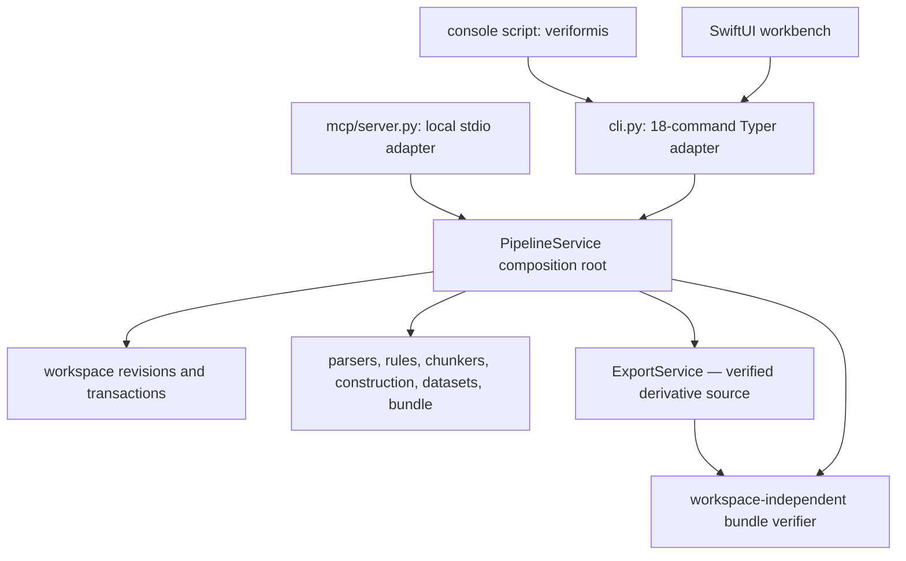
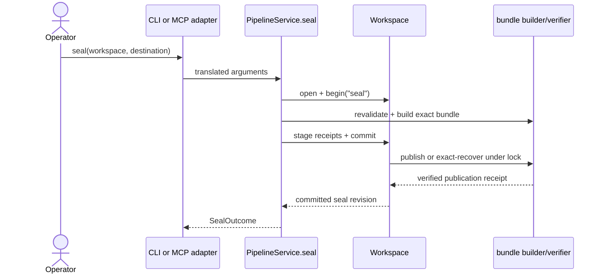

# Entry points

How invocation reaches Veriformis through one surface-neutral orchestration
root, with CLI, MCP, Python, and macOS adapters kept outside stage policy.

**Last reviewed:** 2026-08-21 (Phase 4.3 source-trust reconciliation)

**Next review:** Any entry-point or architecture change

## Multiple adapters, one orchestration root

`veriformis.pipeline.PipelineService` owns stage policy, verified artifact
loading, workspace transactions, sealing, independent verification, and
read-only preview behavior. It also injects and owns the consumer-neutral
`exports.ExportService`; that service is currently a Python composition
boundary, not an adapter-visible command.

| Surface | How it enters |
| --- | --- |
| Python API | Call `PipelineService` methods directly |
| CLI | Console script `veriformis` → thin Typer adapter |
| MCP | `veriformis mcp` → local stdio tools over the same service |
| macOS workbench | SwiftUI app builds and runs `veriformis` CLI commands |

There is no package `__main__.py`, so `python -m veriformis` is unsupported.
Every mutating stage becomes visible through one atomic workspace `HEAD`
transition regardless of the adapter that initiated it.

## CLI command surface

The CLI exposes 18 commands. Nine map one-to-one onto the workspace stages:
`parse`, `clean`, `chunk`, `construct`, `curate`, `split`, `format`,
`validate`, and `seal`. The remaining commands are `upgrade-workspace`,
`verify`, `preview`, `run`, `list-recipes`, `mcp`, `handoff`,
`handoff-verify`, and `version`. Ordering is enforced by the workspace
dependency table, not by Typer.

## Stage transaction template

Each mutating `PipelineService` method opens or creates a workspace, checks the
current revision and stage dependencies, loads and re-verifies upstream
artifacts, calls the deterministic domain implementation, stages
content-addressed outputs, and commits once. `Workspace.begin(stage)` rejects
missing or stale dependencies. Commit rechecks `HEAD` under an exclusive lock,
validates cross-artifact semantics, installs objects and the immutable revision,
then atomically promotes `HEAD`. A changed base raises
`workspace-revision-conflict`; a changed stage invalidates its descendants.

The service owns `_load_sources`, `_load_documents`, `_load_chunks`, and the
other replay helpers. CLI and MCP therefore translate inputs and outcomes but
do not reimplement parse, construction, split, validation, or recovery policy.

## Seal and independent verification

`PipelineService.seal` reloads the current validated state, rebuilds the
validation report, and requires exact equality with the saved passing report.
It builds the manifest and attestation, stages them as workspace receipts, and
registers the narrow seal publication action on the transaction. Publication
writes and verifies a temporary closed bundle before atomic promotion. If an
exact bundle became visible before its receipt committed, retry recovery adopts
it only after external-digest verification and byte-for-byte comparison.

`PipelineService.verify` deliberately does not open a workspace. It passes only
the sealed directory and optional expected manifest digest to
`verify_finished_bundle`. `self_consistent` proves internal agreement;
`external_digest` additionally requires a matching digest from a separate
trusted channel. The optional Aptus handoff is a separate adapter artifact and
is not required for core bundle verification.

## Phase 4 export composition and model boundary

`PipelineService.export_service` exposes the injected `ExportService` to
Python composition. Its `verified_source` method calls
`inspect_finished_bundle`, which returns an immutable
`VerifiedFinishedBundle` containing the manifest, validation report,
reconstructed row set, and existing verification result from the same
descriptor-anchored pass. The ordinary `verify_finished_bundle` return type is
unchanged. Export-source admission defaults to `require_external_digest`; a
caller must explicitly request `allow_self_consistent` to proceed without a
retained expected digest. Any supplied digest remains authoritative and a
mismatch never downgrades to self-consistent trust.

There is no `export` or `export-verify` CLI command, MCP tool, or macOS action
in these opening increments. Strict v1 plan, profile, membership, binding,
receipt, and verification models now exist, but there is no public plan builder,
writer, or generic derivative container; those are later Phase 4 services and
surfaces, not implied by the model boundary.

## Preview, recipes, and optional integrations

`PipelineService.preview` uses the same parse and cleaning plan/replay machinery
without committing state. `run` loads a versioned YAML pipeline and calls the
same service methods. MCP tools do likewise. The `handoff` and
`handoff-verify` commands expose the optional Aptus sibling descriptor; they do
not change the canonical six-file bundle or the stage dependency graph.

## Error funnel and exit semantics

Domain failures carry stable codes rooted at `VeriformisError`. The CLI's
shared `_run` and `_echo_error` helpers render them as
`error[code]: message`. Input and evidence failures normally exit 2;
`validate`, `seal`, and `verify` use exit 1. A valid but failing validation
report is committed for inspection and still exits 1. Partial publication is
surfaced explicitly through `SealPartialPublicationError`, and uncertain final
syncs are warnings rather than silent success claims.

MCP serializes the same typed service outcomes as JSON. The SwiftUI workbench
records the generated CLI plan and process result, so it inherits CLI exit and
error semantics rather than implementing a second pipeline.

## Related documentation

- [Architecture overview](README.md)
- [Layers](layers.md)
- [Dependencies](dependencies.md)
- [Data flow](data-flow.md)
- [Architecture hub](../architecture.md)
- [CLI reference](../cli.md)
- [Aptus Handoff Contract v1](../contracts/aptus-handoff-v1.md)
