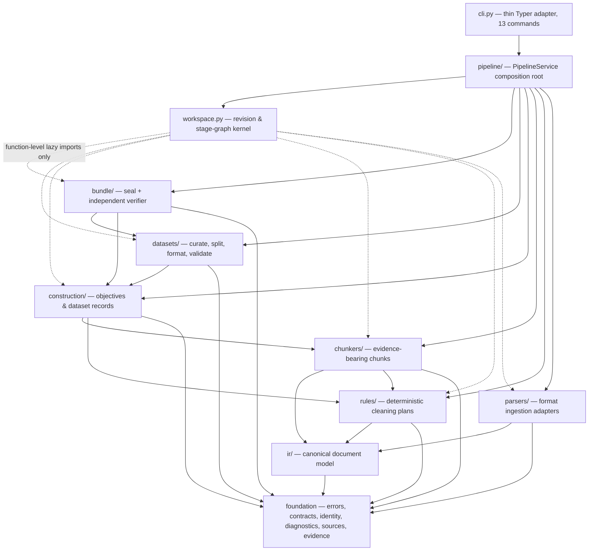

# Layers

How the Veriformis source tree is organized: a strict, acyclically ordered
layer stack, the responsibility of each layer, the isolation techniques that
keep the stack acyclic, and the exception flow that mirrors it.

**Last reviewed:** 2026-08-06 (full documentation consistency pass)

**Next review:** Any layering or architecture change

Veriformis is organized as a strict, acyclically ordered stack of logical
layers, above which sit axial modules: `workspace.py` (persistence kernel),
`pipeline/` (typed composition root), `recipes/`, `handoff/`, `mcp/`, and
`cli.py` (Typer adapter). The SwiftUI workbench under `macos/` is outside the
Python package and shells the CLI. From the bottom up,
the stack comprises a foundation kernel (`errors.py`, `contracts.py`,
`identity.py`, `diagnostics.py`, `sources.py`, `evidence.py`), the canonical
document model (`ir/`), ingestion adapters (`parsers/`), deterministic
cleaning (`rules/`), evidence-bearing chunking (`chunkers/`), dataset
construction (`construction/`), the finished-dataset lifecycle (`datasets/`),
and sealing plus independent verification (`bundle/`). A full import-graph
inspection confirms that every intra-project dependency points downward: no
lower layer imports a higher one, and the only cycle anywhere in
`src/veriformis/` is a single load-order-safe intra-package edge between
`ir/__init__.py` and `ir/serde.py`. This ordering is the project's strongest
structural property, because it makes the nine-stage pipeline's data flow and
the module dependency graph two expressions of the same acyclic order.

## Responsibility allocation across the stack

The foundation kernel carries the cross-cutting semantics that every other
layer consumes but none redefines. `errors.py` provides the entire exception
taxonomy with zero dependencies (see `src/veriformis/errors.py:6`),
`identity.py` provides exact-string deterministic JSON, SHA-256 digests, and
domain-separated durable IDs, and `contracts.py` anchors the cross-layer
registry: stage schema IDs (see `src/veriformis/contracts.py:84-89`), the
seventeen ordered validation gate names (see
`src/veriformis/contracts.py:114-132`), and reason/error codes. Layering these
constants beneath everything else is a deliberate choice: because the
vocabulary of the inter-layer contracts lives in a zero-dependency module, any
two layers can exchange versioned artifacts without importing each other.

Above the foundation, `ir/` defines the canonical `Document`/`Block`/`Inline`
tree that serves as the shared vocabulary of the whole ingestion half of the
system. Notably, `ir/nodes.py` imports nothing from the project at all — only
`dataclasses` and `typing` (see `src/veriformis/ir/nodes.py:3-6`) — making it
the only true leaf module outside the foundation kernel and guaranteeing that
the document model can never be contaminated by ingestion- or dataset-layer
concerns. The `parsers/` layer converts raw captured sources into this model,
one adapter per format, behind the single entry point
`parse_captured_source()`; its output contract is `sources.ParseResult`, which
pairs the IR document with a mandatory `ParseReport` of located diagnostics.
The `rules/` layer then performs deterministic cleaning over the IR, and its
central design decision — separating `plan_cleaning` from replay in
`rules/cleaning.py` — is what makes cleaning a replayable, auditable stage
rather than an opaque mutation. `chunkers/` binds text spans to
`evidence.SourceEvidence`, so every `Chunk` carries its provenance chain by
construction rather than by convention.

The upper half of the stack progressively discards implementation detail.
`construction/` converts chunks, transform records, and a `DatasetRecipe` into
`CandidateRecord` and `DatasetRecord` objects governed by a
`TrainingObjective`; `datasets/` then operates purely on those construction
records — curation, leakage-safe splitting, objective-aware row lowering, and
the seventeen-gate validation snapshot — while `bundle/` seals an exact
validated snapshot into a six-file bundle with deterministic manifest and
attestation, and `bundle/verifier.py` re-derives row sets independently of any
workspace. Each layer's input is therefore the previous layer's most abstract
output, never its internal machinery.

## The unidirectional dependency rule and its enforcement

The dependency rule is enforced by nothing more exotic than import discipline,
but that discipline is absolute, and in one place it is elevated into a
correctness mechanism. The `datasets/` package imports only `construction`,
`contracts`, `errors`, and `identity`; it never imports `chunkers`, `rules`,
`ir`, or `parsers`, a fact verified across every module in the package (the
import block of `src/veriformis/datasets/validation.py:19-33` is
representative). Consequently the legacy chunk-row path is not merely
deprecated but *unreachable* from the finished-dataset stages: the dependency
graph itself makes it impossible to accidentally project chunks as product
rows. This is the art of isolation at its most economical — a layer boundary
doing the work of a runtime assertion.

The module-level DAG also has a runtime counterpart. `workspace.py` declares
the nine-stage dependency graph as data, `STAGE_DEPENDENCIES`, in which
`validate` depends on all of `parse` through `format`, and `seal` on
everything (see `src/veriformis/workspace.py:138-165`). Because the stage
graph is acyclic for the same reason the module graph is, stale-input
detection and replay ordering reduce to simple graph walks. One minor blemish
exists at the seam: `bundle/verifier.py` hardcodes the literal
`"veriformis.exact-record-fingerprint/v1"` rather than routing it through
`contracts.py` (see `src/veriformis/bundle/verifier.py:606`), a small leak in
an otherwise well-centralized registry.

## Boundary isolation: the lazy kernel and the serde membrane

The system's most distinctive isolation technique exists because
`workspace.py` is the architectural hub that must touch every stage domain
without being allowed to depend on any of them at module load time. Its
top-level imports are restricted to `contracts`, `errors`, and `identity` (see
`src/veriformis/workspace.py:26-58`); all twelve-plus stage-domain imports —
`chunkers.base`, `construction`, `rules.engine`, `rules.cleaning`,
`rules.library`, `sources`, `datasets`, `bundle`, `evidence`, `ir`,
`diagnostics`, and `parsers.dispatch` — are deferred into the function bodies
that replay-validate each stage before commit (see, for example,
`src/veriformis/workspace.py:3007-3028` for the chunk/clean replay block,
`src/veriformis/workspace.py:2467` for curation, and
`src/veriformis/workspace.py:3408-3412` for parse). Were any of these imports
hoisted to module scope, the kernel would import `datasets`, which imports
`construction`, and the hub would become part of a cycle; the lazy-import
convention is therefore not a stylistic quirk but the load-bearing mechanism
that lets a 3,541-line god-module sit above the stack without collapsing its
acyclicity. The same pattern recurs wherever a hub would otherwise form:
`bundle/finished.py` keeps only `errors`/`identity` at module scope and lazily
imports `datasets.validation` (see `src/veriformis/bundle/finished.py:181`),
`bundle/verifier.py` lazily imports `construction` and
`datasets.serialization` to re-derive rows (see
`src/veriformis/bundle/verifier.py:389-390`), and even within `rules/`,
`engine.py` defers its import of `cleaning.plan_cleaning` into a function body
to break an intra-layer cycle (see `src/veriformis/rules/engine.py:282`).

Between stages, isolation is achieved through a serde membrane rather than
shared mutable objects. Every persisted model ships paired
`x_to_dict`/`x_from_dict` functions built on the exact-string JSON of
`identity.py`, so the bytes committed to the workspace — not the in-memory
objects of the producing layer — are the authoritative interface. The CLI's
load-helpers reconstruct domain objects from these versioned payloads, meaning
a consumer never observes a producer's internals, only its registered schema.
Each domain package additionally curates its public surface through
`__init__.py` re-exports, although the composition root itself breaks this
convention by importing submodules directly, as in
`from veriformis.chunkers.base import ...` and
`from veriformis.parsers.dispatch import ...` (see `src/veriformis/cli.py:28-29`
and `src/veriformis/cli.py:112`). This eager, submodule-level wiring is
coherent with `cli.py`'s role as the single composition root — the one place
where all layers are permitted to meet (its import block spans every layer at
`src/veriformis/cli.py:18-141`) — but the accompanying per-command
load–run–commit ceremony, duplicated across thirteen commands, is the
acknowledged debt that a surface-neutral PipelineService (**planned**,
Group 4) is intended to absorb.

## Exception handling flow

Error propagation mirrors the layering: exceptions originate in the foundation
taxonomy, accrete context as they cross layer boundaries, and are rendered
only at the composition root. `errors.py` defines a single `VeriformisError`
base carrying a stable, machine-readable `code` class attribute (see
`src/veriformis/errors.py:6-7`), specialized per layer — `ParseError`,
`RuleError`, `CleaningPlanError`, `EvidenceError`, `ConstructionError`,
`CurationError`, `SplitError`, `SerializationError`, `DatasetValidationError`,
`SealError`, `BundleVerificationError`, plus the workspace's own concurrency
and corruption errors (see `src/veriformis/errors.py:86-120`). Because every
subclass carries its code, an error's layer of origin survives translation all
the way to the terminal.

Transformation happens at boundaries with explicit chaining. A representative
case is the CLI's evidence-binding check: a `ParseError` raised while
validating report locations is caught and re-raised as an `EvidenceError` with
source-scoped context via `raise ... from exc` (see
`src/veriformis/cli.py:369-371`), converting a lower-layer diagnostic failure
into the provenance-layer vocabulary the caller understands. The workspace
kernel adds a second, temporal dimension to error handling:
`_validate_stage_semantics` replays each stage deterministically and raises
typed errors — such as the `"curation result does not match deterministic
replay"` check (see `src/veriformis/workspace.py:2497-2505`) — strictly
*before* the atomic commit point, since it is invoked prior to object and
revision installation (see `src/veriformis/workspace.py:2254-2262`) and no
fallible work is permitted after HEAD replacement (see the invariant at
`src/veriformis/workspace.py:2275-2277`). Semantically invalid state therefore
can never become durable; failures surface as exceptions on the producing side
of the transaction, never as corrupted revisions on the consuming side. At the
outermost boundary, `_echo_error` renders any typed failure as
`error[code]: message` on stderr with a deterministic exit status (see
`src/veriformis/cli.py:198-202`), invoked from command-level catches of
`VeriformisError` and its companions (see `src/veriformis/cli.py:950-951`).

A deliberate second channel complements the exception path: diagnostics as
data. Parsers do not raise for recoverable degradations; they emit a
`ParseReport` of located `ParseDiagnostic` entries (see
`src/veriformis/diagnostics.py:137-160`) that travels inside the `ParseResult`
and is itself validated against captured source bytes. Similarly, the
validation stage's seventeen gates produce an ordered
`DatasetValidationReport` aligned to `V1_FINISHED_DATASET_GATES` (see
`src/veriformis/datasets/validation.py:1270-1273`) rather than raising on the
first failure. This split — exceptions for contract violations, reports for
quality judgments — keeps the exception channel semantically crisp: a raised
error always means a broken invariant, while a gate failure remains
inspectable evidence that downstream stages and the sealed attestation can
reference by content digest.

## Structural assessment

Taken as a whole, the layered design achieves what it sets out to do: a
unidirectional, verifiable flow in which provenance only ever moves upward and
authority only ever moves downward. The costs are concentrated exactly where
the isolation techniques are working hardest. `workspace.py`'s lazy-import
kernel is correct but brittle — every new stage must reproduce the convention
by hand, and the per-stage replay validators it harbors are the natural
extraction candidates should the kernel be split. The retained legacy layers
(`serializers/`, `validate/gates.py`, `bundle/writer.py`) have zero production
imports yet remain exported side by side with their successors from
`bundle/__init__.py` (see `src/veriformis/bundle/__init__.py:14-18`), and the
near-duplicate exact-JSON validators in `construction/_json.py` and
`datasets/_json.py` show the foundation kernel failing to absorb a genuinely
cross-layer concern. These are localized debts, however, sitting on top of —
and made visible by — a dependency discipline that the rest of the system
enforces without exception.

## Related documentation

- [Architecture overview](README.md)
- [Dependencies](dependencies.md) — fan-in figures, external containment, and
  the deferred-import idiom in graph terms
- [Data flow](data-flow.md) — the shapes that cross these layer boundaries
- [Entry points](entry-points.md) — how commands drive the layers through the
  workspace kernel
- [Architecture hub](../architecture.md)
