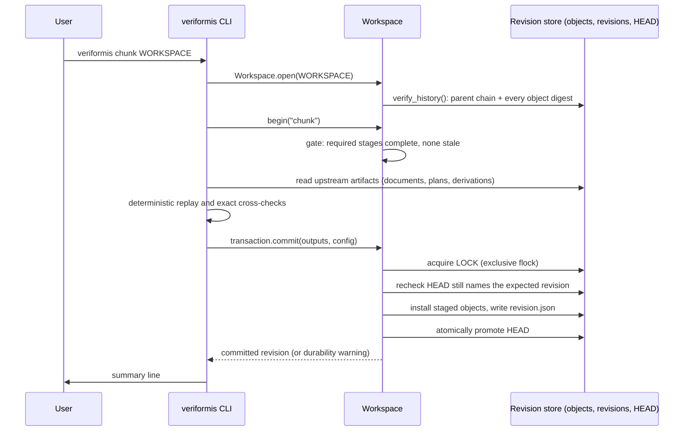

# CLI Reference

Veriformis ships one console entry point, `veriformis`
(`veriformis.cli:main`) — a thin Typer adapter over
`veriformis.pipeline.PipelineService`. **Stage commands**
(`parse`, `clean`, `chunk`, `construct`, `curate`, `split`, `format`,
`validate`, `seal`) advance one immutable, transactional workspace through
the dataset pipeline. Additional commands cover maintenance
(`upgrade-workspace`), immutable transport (`package`, `package-verify`),
read-only inspection (`verify`, `preview`), recipes
and YAML automation (`run`, `list-recipes`), Aptus handoff (`handoff`,
`handoff-verify`), taxonomy discovery (`taxonomy`), goal and preset discovery
and inspection (`goals`, `presets`, `modes`, `preflight`, `goal-preview`), local MCP (`mcp`), verified
exports (`export`, `export-verify`), and `version`. The complete root surface is
28 commands; `export` contains four subcommands.

This page is the command reference. For architecture, see
[Architecture: entry points](architecture/entry-points.md). For a guided first
run, see the [quickstart](../README.md). Everything below describes the
implemented `0.1.0` behavior unless marked planned.

**Last reviewed:** 2026-08-23 (independent-product Phase 7.1 opening)

**Next review:** Any CLI surface or release-gate documentation change

## Run the CLI

From a development checkout:

```bash
uv sync --extra test
uv run veriformis --help
```

An installed environment exposes the same application as `veriformis`. The
examples below use the installed name.

## Command groups

| Role | Commands | Writes state? |
| --- | --- | --- |
| Stage | `parse`, `clean`, `chunk`, `construct`, `curate`, `split`, `format`, `validate`, `seal` | Commits one atomic workspace revision per changing run; `seal` publishes a canonical six-file bundle and currently offers a separately controllable Aptus sibling descriptor |
| Maintenance | `upgrade-workspace` | Appends migration revisions when the workspace is behind |
| Automation | `run`, `list-recipes`, `mcp` | `run` may commit stages and seal; `mcp` is long-lived stdio |
| Handoff | `handoff`, `handoff-verify` | `handoff` writes a sibling descriptor; `handoff-verify` is read-only |
| Transport | `package`, `package-verify` | `package` writes a verified deterministic archive; `package-verify` is read-only |
| Verified export | `export discover`, `export dry-run`, `export inspect`, `export execute`, `export-verify` | Only `export execute` may publish, always with no-replace `refuse`; discovery includes split JSONL, canonical JSON, and constrained CSV v1 |
| Read-only | `verify`, `preview`, `taxonomy`, `goals`, `presets`, `preflight`, `goal-preview` | Nothing |
| Meta | `version` | Nothing |

## Supported inputs

`parse` (and raw-file `preview`) accepts explicit files with these extensions:

- documents: `.txt`, `.md`, `.markdown`, `.docx`, `.html`, `.htm`, `.pdf`;
- structured: `.csv`, `.json`, `.jsonl`;
- source code: `.py`, `.js`, `.ts`, `.java`, `.c`, `.cpp`, `.go`, `.rs`,
  `.rb`, `.sh`.

Source code enters as one language-tagged code block. Digitally-born PDFs with
no extractable text layer refuse with a named OCR limitation. Directories are
not expanded by the CLI (the workbench may expand folders before calling
`parse`). Raw-source capture rejects symlink components and non-regular files,
and walks from a pinned source-root descriptor so a concurrent retarget cannot
escape the chosen root. Text and structured inputs must be UTF-8.

## Workspace and artifacts

Stage commands exchange immutable artifacts through this workspace layout:

```text
WORKSPACE/
├── workspace.json
├── HEAD
├── LOCK
├── objects/sha256/<prefix>/<digest>
├── revisions/<revision-id>/revision.json
└── .txn/
```

The physical layout is schema 1; active revisions use schema 3
(`src/veriformis/workspace.py:60-63`). `HEAD` names the current immutable
revision and its logical output map. Opening a workspace verifies the complete
parent chain and every referenced object digest before returning
(`src/veriformis/workspace.py:1652-1655`). Every successful stage commits one
revision atomically; rerunning an upstream stage marks every descendant stage
`stale`, while older revisions remain immutable history.

### Stage gating

A stage command runs only when each stage it depends on is `complete` in the
current revision. A dependency left `stale` by an upstream rerun fails with
`error[stale-stage]`; a dependency that is `absent` or `failed` fails with
`error[missing-stage-input]` (`src/veriformis/workspace.py:1919-1926`). The
finished-dataset stages additionally require revision schema 3, and
`construct` requires schema 2 or later.

| Stage | Requires complete | Logical output keys |
| --- | --- | --- |
| `parse` | — (creates or reuses a workspace) | `registry`; per-source `raw`, `canonical`, `document`, `diagnostics` |
| `clean` | `parse` | `transforms`; per-source `document`, `cleaning-plan`, `block-derivations` |
| `chunk` | `clean` | `chunks` |
| `construct` | `parse`, `clean`, `chunk`; schema ≥ 2 | `recipe`, `result` |
| `curate` | `construct`; schema 3 | `plan`, `result` |
| `split` | `construct`, `curate` | `result` |
| `format` | `construct`, `curate`, `split` | `row-set`, `train`, `evaluation`, `provenance` |
| `validate` | all of the above | `snapshot`, `report` |
| `seal` | all of the above, with a passing `validate` | `manifest`, `attestation` |

If `HEAD` becomes visible but the final directory sync cannot be confirmed,
the command still succeeds and prints `warning[commit-durability]`. Preserve
the workspace and verify it once storage is stable.

## Stage commands

### `parse`

Capture raw files and commit one canonical parse revision.

```text
veriformis parse PATHS... -o WORKSPACE [--source-root ROOT]
```

| Option | Default | Effect |
| --- | --- | --- |
| `-o PATH` | (required) | Workspace directory; created when new |
| `--source-root ROOT` | current directory | Stable root for logical paths; every input must resolve beneath it |

The command captures raw bytes before parsing and commits all paths together.
Each source ID binds its logical path and raw SHA-256, so same-basename inputs
remain distinct when their logical paths differ, and distinct logical sources
with identical bytes also remain distinct. Adding another file to a parse
batch does not change an existing source identity.

- **Reads:** the input files.
- **Writes:** a new revision with the source registry plus, per source, the
  raw bytes, canonical extracted text, strict document IR, and mandatory parse
  report. Error-severity diagnostics prevent commit; before `HEAD` advances,
  the transaction cross-validates registry, descriptors, canonical text, IR
  projection, and diagnostics.

The output directory may be new or an existing revision workspace; it may not
be a non-empty unrelated directory. Re-running `parse` replaces parse state
and marks all later stages stale.

Failure modes (exit 2): `unsupported-input` for an unsupported extension;
`parse-error` when the parser refuses an input (for example a malformed DOCX);
`invalid-source-locator` when an input lies outside the source root;
`workspace-corrupt` for a non-empty unrelated output directory;
`unsupported-workspace-version` for a legacy flat workspace.

### `clean`

Plan, replay, and atomically commit cleaning for every source.

```text
veriformis clean WORKSPACE [--rules NAME,NAME] [--custom REGEX]
```

| Option | Default | Effect |
| --- | --- | --- |
| `--rules NAME,NAME` | `page-numbers,whitespace` | Comma-separated built-in rule selection; supplying `--rules` or `--custom` replaces the default selection |
| `--custom REGEX` | none | Adds one regular-expression removal rule; matches are removed (there is no replacement-text option) |

Built-in rules: `page-numbers`, `headers-footers`, `whitespace`, `urls`,
`emails`, `special-chars`, `lowercase` (`src/veriformis/rules/library.py:74`).

Requires `parse` complete. For each source, clean creates and replays a
source-scoped plan binding configuration, operations, before/after digests,
character and byte counts, warnings, and a portable parse-input digest.

- **Reads:** parse-stage documents, sources, and registry (re-verified).
- **Writes:** per-source cleaned IR, the exact cleaning plan, block
  derivations, and the combined transform log.

A rule that would remove more than 30 percent of its target is skipped and
reported as `warning[<source-id>]: rule '<name>' skipped: ...`
(`src/veriformis/rules/cleaning.py:776`). Prose rules never edit inline code,
code blocks, math, or other literal payloads. Re-running clean with an
unchanged configuration is a no-op and prints
`clean unchanged at revision <id>`.

Failure modes (exit 2): `rule-error` for an unknown rule name, an invalid
custom expression, or an empty effective selection; `missing-stage-input` /
`stale-stage` gating errors.

### `chunk`

Chunk cleaned documents with exact reconstructible source evidence.

```text
veriformis chunk WORKSPACE [--goal GOAL | --preset PRESET] \
  [--strategy STRATEGY] [--size N] [--overlap N]
```

| Option | When omitted | Effect |
| --- | --- | --- |
| `--goal` / `--preset` | recipe-wide preset defaults | Select the goal's safe preset (or the named preset) whose segmentation applies |
| `--strategy` | preset value | One of `paragraph`, `fixed`, `sliding`, `sentence`, `structure` |
| `--size` | preset value | Target chunk size in characters |
| `--overlap` | preset value | Overlap in characters; used only by `fixed` and `sliding` |

Every setting option is an explicit override; the values themselves live in
the versioned [Recipe Preset Contract v1](contracts/recipe-preset-v1.md)
data (`veriformis presets` prints them). `size` must be at least 1 and
`overlap` must satisfy `0 <= overlap < size`; violations pass through the
shared CLI error funnel as `error[invalid-data]: ...` and exit 2.

- `paragraph` groups blocks without exceeding `size` when possible.
- `fixed` creates fixed character windows with optional overlap.
- `sliding` uses overlapping windows.
- `sentence` groups heuristic English sentence splits up to `size`.
- `structure` starts sections at headings and applies paragraph grouping.

Requires `clean` complete. Every chunk carries a source-scoped identity and
reconstructible `SourceEvidence`; chunks never cross body, footnote, or
endnote regions, and chunk text is checked against resolved evidence on every
load by the `PipelineService` artifact loaders.

- **Reads:** cleaned documents, sources, transform records, block derivations,
  cleaning plans.
- **Writes:** `chunks`.

### `construct`

Construct evidence-bearing candidates and immutable accepted records. Makes no
LLM call; there is no `summary` objective.

```text
veriformis construct WORKSPACE (--goal GOAL | --preset PRESET | --objective OBJECTIVE) \
  [--representation ID] [--source SELECTOR]... [--target-row-schema SCHEMA] \
  [--consumer-profile PROFILE] [--split-ratio-ppm PPM] \
  [--require-review | --no-require-review]
```

| Option | When omitted | Effect |
| --- | --- | --- |
| `--goal` | — | Plain-language goal id from `veriformis goals`; resolves through the goal's safe preset |
| `--preset` | — | Recipe preset id from `veriformis presets`; implies its goal and representation, and fails closed unless the workspace chunks match its segmentation |
| `--objective` | — | Persisted objective kind (legacy selection); resolves through its goal's safe preset |
| `--representation` | preset value | Catalog representation id; must be compatible with the goal |
| `--source` | all current sources | Repeatable; selects an exact subset by source ID or logical path |
| `--target-row-schema` | preset value | Legacy row-schema selection: `text`, `prompt_completion`, `instruction_output`, or `messages` |
| `--consumer-profile` | preset value | Compile-time compatibility constraint; implemented profiles are canonical v1 and `aptus-handoff-v1` |
| `--split-ratio-ppm` | preset value | Opening share for `continuation` only; 1–999999 |
| `--require-review` / `--no-require-review` | preset value | Leaves construction-integrity decisions pending instead of accepting valid candidates |

Exactly one selection path is required. `--goal` and `--objective` adopt the
workspace's existing chunk configuration; `--preset` requires it to equal the
preset's segmentation (re-run `chunk --preset` otherwise). The recipe is built
through the named recipe library, so the same effective settings yield the
same `recipe_id` from every path and every surface.

| Objective | Fields |
| --- | --- |
| `full_text` | `text` |
| `continuation` | `prompt`, `completion` |
| `section_reconstruction` | `heading`, `section` |
| `before_after_transformation` | `before`, `after` |
| `structured_field` | `input`, `fields` |

`full_text` requires the `text` row schema; every other objective requires a
supervised row schema. Unknown or duplicate `--source` selections fail closed.
The Aptus profile rejects `text` before the workspace is opened or changed.
`--require-review` leaves decisions pending because the current CLI does not
ingest completed review evidence (the Python construction API supports
separate review values).

Requires `parse`, `clean`, and `chunk` complete, on revision schema 2 or
later. Before commit, the workspace reconstructs all selected upstream inputs
and requires exact semantic equality with a fresh construction replay.

- **Reads:** sources, chunks, transforms, cleaned IR artifacts, stage configs.
- **Writes:** canonical `recipe` and `result` artifacts.

Failure modes (exit 2): `construction-invalid` for an unsupported objective,
an unknown goal or preset, an incompatible representation, an invalid
row-schema/profile combination, an out-of-range ratio, a preset/chunk
mismatch, or a replay mismatch; `source-evidence-invalid` for unknown or
duplicate source selection; `unsupported-workspace-version` when the
workspace predates schema 2 (run `upgrade-workspace` first).

### `curate`

Fix the complete `FinishedDatasetPlan`, then apply its curation policy.

```text
veriformis curate WORKSPACE [--goal GOAL | --preset PRESET] \
  [--minimum-target-characters N] [--balance-mode none|primary-source-cap] \
  [--maximum-records-per-primary-source N] [--evaluation-ratio-ppm PPM] \
  [--require-evaluation | --allow-empty-evaluation] [--split-seed SEED] \
  [--instruction TEXT]
```

| Option | When omitted | Effect |
| --- | --- | --- |
| `--goal` / `--preset` | the constructed goal's safe preset | Must agree with the constructed recipe's objective |
| `--minimum-target-characters` | preset value | Excludes records whose target fields are shorter |
| `--balance-mode` | preset value | `none` or `primary-source-cap` (the persisted spelling is rejected at the surface) |
| `--maximum-records-per-primary-source` | preset value | Cap per primary source; required (positive) with `primary-source-cap`, invalid with `none` |
| `--evaluation-ratio-ppm` | preset value | Requested evaluation partition ratio, 1–999999 |
| `--require-evaluation` / `--allow-empty-evaluation` | preset value (required) | Permits a sole leakage group to remain entirely in train |
| `--split-seed` | preset value | Seed entering the deterministic group order |
| `--instruction` | the selected goal's catalog template | Required to be truthful when supplied for `instruction_output`; omitted uses the catalog template; rejected for all other row schemas |

Curation runs minimum-target filtering, source-scoped conflict quarantine,
exact deduplication, optional primary-source cap, and coverage closure, in
that order (`src/veriformis/datasets/curation.py:77-81`).
`--allow-empty-evaluation` does not force evaluation empty when two or more
leakage groups exist.

Requires `construct` complete on revision schema 3.

- **Reads:** construction recipe and result, reconstructed upstream inputs.
- **Writes:** `plan` (the finished dataset plan) and `result` (curation
  decisions and coverage ledger).

The command prints included, excluded, and quarantined counts plus the plan
and revision IDs, and prints coverage blockers to stderr. A result with
blockers is still committed and auditable, but later validation cannot pass.

Failure modes (exit 2): invalid policy combinations (balance mode, source
cap, ratio range, `--instruction` misuse) raise untyped validation errors and
surface as `error[invalid-data]`; `curation-invalid` on replay or identity
mismatch; `unsupported-workspace-version` on a pre-schema-3 workspace.

### `split`

Assign complete transitive leakage groups to fixed partitions.

```text
veriformis split WORKSPACE
```

Split has no policy options: it reads the plan fixed during `curate`, because
a second policy surface could contradict that plan. Included records connect
through shared source IDs, equal raw-source digests, multi-source joins, and
inherited exact-dedup-family relations; complete transitive components become
indivisible leakage groups. Assignment is deterministic from the bound ratio
and seed, and no group crosses partitions.

Requires `construct` and `curate` complete.

- **Reads:** plan, curation result, construction result, raw-source digests.
- **Writes:** `result` — groups, assignments, requested and realized counts,
  and an assignment digest.

Failure modes (exit 2): `split-invalid` when evaluation is required but fewer
than two leakage groups exist (`src/veriformis/datasets/splitting.py:615`),
or when curation included no records.

### `format`

Lower curated records into the row schema fixed by their dataset plan.

```text
veriformis format WORKSPACE
```

The persisted `format` stage is row lowering, not a taxonomy selector. It has
no row-schema override or `--format` option: it reads the row schema from the
bound recipe and finished plan. It consumes construction records, curation
decisions, and authoritative assignments — never raw chunks. One included record produces
exactly one payload row and one provenance row.

Payload rows contain only their schema keys: `text` rows contain only `text`;
prompt-completion rows only `prompt` and `completion`; instruction rows only
`instruction`, `input`, and `output`; message rows only the exact two-turn
(user, assistant) `messages` value (`src/veriformis/datasets/serialization.py:154`).
Rows are sorted by record ID within each partition; provenance is train first,
then evaluation, with zero-based partition ordinals and exact payload digests.

Requires `construct`, `curate`, and `split` complete.

- **Reads:** plan, recipe, construction result, curation result, split result.
- **Writes:** `row-set` (strict semantic row set), `train` and `evaluation`
  (payload-only JSONL), and `provenance` (one combined aligned metadata
  stream).

Failure modes (exit 2): `serialization-invalid` when a row would invent
semantics or diverge from its accepted record.

### `validate`

Replay and validate one exact finished-dataset byte snapshot.

```text
veriformis validate WORKSPACE
```

Validate has no options. It builds one exact snapshot and runs all 17
required gates in this order (`src/veriformis/contracts.py:114`):

1. `construction-replay`
2. `record-lifecycle`
3. `curation`
4. `deduplication`
5. `quality`
6. `balance`
7. `coverage`
8. `split`
9. `leakage`
10. `row-binding`
11. `objective`
12. `schema`
13. `encoding`
14. `masking`
15. `partition-nonempty`
16. `aptus-row-shape`
17. `snapshot`

Requires every stage from `parse` through `format` complete.

- **Reads:** all upstream artifacts, reconstructing and replaying each stage.
- **Writes:** `snapshot` and `report`, committed with stage status `complete`
  when the report passes and `failed` otherwise.

The command prints every gate status and finding, then the snapshot and
revision IDs. A failing report is still committed — with failed stage status —
and the command exits 1 without printing an error line. Every typed error from
this command also exits 1.

`aptus-row-shape` is a legacy gate ID retained for contract compatibility. It
proves the generic declared product-row shape only; it does not require Aptus
or prove handoff intake or backend partition enforcement.

### `seal`

Revalidate, atomically publish, and receipt one finished dataset.

```text
veriformis seal WORKSPACE -o OUTPUT.vfbundle
```

| Option | Default | Effect |
| --- | --- | --- |
| `-o PATH` | (required) | Bundle destination; for a fresh publication it must not exist |
| `--aptus-handoff` / `--no-aptus-handoff` | off | Explicitly opt in to the optional sibling Aptus descriptor; it is not part of the six-file bundle |

Requires all stages through `validate` complete, with a passing validation
report. Seal reloads the current revision, rebuilds the exact validation
report, and requires equality with the saved passing report. It publishes
exactly:

```text
OUTPUT.vfbundle/
├── data/train.jsonl
├── data/evaluation.jsonl
├── metadata/row-provenance.jsonl
├── validation.json
├── manifest.json
└── attestation.json
```

Seal writes into a private temporary sibling, copies the validated payload
bytes without reserialization, writes the deterministic manifest and
attestation, syncs and independently verifies the temporary bundle, rechecks
the expected workspace revision, and atomically promotes the directory. It
then commits the exact manifest and attestation bytes as workspace receipts.
It never overwrites the destination: if an earlier attempt published the exact
bundle but failed before committing receipts, a retry recovers only after
external-digest verification and byte-for-byte comparison
(see `_recover_exact_finished_bundle` in `pipeline/service.py`).

- **Reads:** every upstream artifact, plus the saved validation report.
- **Writes:** the six-file bundle at `-o`, and a seal revision committing
  `manifest` and `attestation` receipts.

The command prints the bundle path, manifest SHA-256, verification grade, and
seal revision. Fresh internal publication reports `self_consistent`; exact
receipt recovery reports `external_digest` because the retry supplies the
expected manifest digest. Retain the printed digest outside the bundle when
external binding matters.

Bundle promotion and receipt commit cannot share one atomic filesystem action.
If publication becomes visible but the receipt commit fails, the command
reports the visible path and digest with the failure; it does not overwrite or
claim rollback. A bundle whose final directory sync is unconfirmed produces
`warning[bundle-durability]`.

Failure modes (exit 1): `missing-stage-input` / `stale-stage` when any
upstream stage is not complete; `error[invalid-data]` when the saved
validation report does not exactly match a fresh replay; `seal-invalid` — including every
`FinishedBundleError`, which subclasses `SealError`
(`src/veriformis/bundle/finished.py:86`) — for an existing non-matching
destination or a publication failure.

## Maintenance commands

### `upgrade-workspace`

Advance a verified workspace through every supported revision migration.

```text
veriformis upgrade-workspace WORKSPACE
```

The command verifies the current history, then applies each supported
migration in order: v1 to v2, then v2 to v3 when both are needed. Each step is
a complete, recoverable commit, so an interrupted upgrade may leave the
workspace safely on v2 and a retry resumes from that exact state
(`src/veriformis/workspace.py:1769-1778`).

- v1 → v2 adds `construct` as absent.
- v2 → v3 preserves parse, clean, chunk, and construct facts; adds `curate`
  and `split` as absent; resets legacy `format`, `validate`, and `seal` state
  to absent, because those artifacts do not satisfy the finished-dataset
  contract.

Historical revisions and objects remain intact. Running the command on a
current workspace is a no-op and prints
`workspace already current at revision <id>`.

Failure modes (exit 2): `workspace-revision-conflict` when `HEAD` moved
mid-migration; `unsupported-workspace-version` when the revision schema
cannot be migrated; the standard workspace integrity errors below.

## Transport commands

### `package`

Create one deterministic no-replace transport under exactly one explicit
external anchor.

```text
veriformis package BUNDLE -o OUTPUT.vfbundle.zip --manifest-sha256 EXPECTED_SHA256

veriformis package EXPORT_DIRECTORY -o OUTPUT.vfexport.zip \
  --export-receipt-sha256 EXPECTED_RECEIPT_SHA256
```

The manifest digest is required and must have been retained outside the
bundle. Packaging first runs canonical bundle verification at
`external_digest` grade. It never ignores or removes unexpected files. The
output contains the same six bundle members in fixed order with deterministic
stored ZIP encoding; it is re-opened, reconstructed, and independently
verified before no-replace publication.

Success prints the archive path, archive SHA-256, manifest SHA-256,
`external_digest` grade, and member count. The archive is a transport wrapper,
not a trainer export and not another bundle profile.

The export-pack form requires the canonical receipt SHA-256 retained from the
successful export response. It descriptor-inspects the unchanged closed export
directory, archives exactly the receipt and its bound files with the same
deterministic stored-ZIP envelope, verifies the staged archive, and then
publishes it. Success additionally prints the embedded export plan and receipt
IDs and preserves the source trust grade recorded by that plan. It does not
rerender rows or turn archive verification into source-bound export
verification.

`--manifest-sha256` and `--export-receipt-sha256` are mutually exclusive and
exactly one is required. The explicit anchor selects the profile; a suffix
never silently selects one.

### `package-verify`

```text
veriformis package-verify ARCHIVE.vfbundle.zip --manifest-sha256 EXPECTED_SHA256

veriformis package-verify ARCHIVE.vfexport.zip \
  --export-receipt-sha256 EXPECTED_RECEIPT_SHA256
```

Verification requires canonical ZIP bytes and metadata, reconstructs only the
six fixed destinations in private temporary storage, and runs the canonical
bundle verifier with the caller's external digest. Traversal, links,
duplicates, extra members, changed bytes, and noncanonical ZIP encodings fail.
For `.vfexport.zip`, verification strict-loads the externally anchored receipt,
reconstructs only its validated paths, proves the closed file bindings and
canonical archive bytes, and reports the unchanged embedded source trust
grade. See [Deterministic Archive Transport v1](contracts/bundle-transport-v1.md).

## Verified-export commands

These commands are thin adapters over the same `PipelineService` operations as
Python, MCP, and the CLI-backed Mac bridge:

Use the [Generic Export Operator Guide](generic-exports.md) to choose a physical
container without conflating it with the already-bound objective, semantic row
schema, or downstream consumer compatibility. Phase 5.6's exact dry-run preview
merged as PR #58 at `cd017941090c7352cb1d10f9a383042b954d4f2e`. Phase 5.7's
guide and Phase 5 closeout merged as PR #59 at
`65cbd471e96d83f8dd65e2cda60e90f64a916e2b`.

```text
veriformis export discover
veriformis export dry-run --request-json JSON
veriformis export inspect --request-json JSON
veriformis export execute --request-json JSON
veriformis export-verify --request-json JSON
```

`discover` accepts no request and lists only executable implementations from the
private service catalog. Phase 4 closed with that catalog empty. Phase 5.1–5.3
now advertise three production selectors: `split-jsonl-directory`, canonical
`json`, and `constrained-csv`, all version 1, `portable_exact_bytes`, and with
no consumer profile. Split JSONL and canonical JSON support all four current
row schemas; constrained CSV supports the three flat schemas only.
Tests may also inject the bounded conformance implementation used for the
historical cross-surface evidence; that remains private test code.

Dry run, execute, and source-bound verify accept the exact historical
`veriformis.export-surface-request/v1` shape for all three containers. Split JSONL
also accepts the configured `veriformis.export-surface-request/v2` shape.
Request v1 is unchanged and, for split JSONL, selects this complete safe
default options object:

```json
{"evaluation_partition_name":"evaluation","include_provenance":true,"schema_version":"veriformis.split-jsonl-options/v1","train_partition_name":"train"}
```

Request v2 adds `container_options`, which must be that complete canonical
`veriformis.split-jsonl-options/v1` object with only the two safe lowercase
filename stems and Boolean provenance choice changed as needed. An empty,
partial, unknown-field, or noncanonical options object is refused. The same
options must be repeated unchanged for dry run, execute, and source-bound
verify because the exact paths and bytes bind the plan ID.

Canonical `json` v1 has no options. Request v1 selects its fixed tree; request
v2 is refused for that selector even when `container_options` is empty.
Constrained `constrained-csv` v1 has the same request boundary: request v1
selects its fixed tree, while request v2 and every options object are refused.

Dry run verifies the selected source and derives a plan plus an exact bounded
preview without renderer or destination access. Its canonical
`veriformis.export-surface-response/v2` result contains exactly `plan` and
`preview`; requests remain v1 or v2 as described above. The preview uses
`veriformis.export-dry-run-preview/v1` and reports:

- the exact `export_plan_id`, `container_profile_id`, `row_set_id`, and
  `row_schema`;
- `first-row-per-non-empty-partition`, selecting ordinal zero in train-then-
  evaluation order and omitting the evaluation sample when that partition is
  empty;
- each sample's partition, ordinal, exact canonical payload SHA-256 and UTF-8
  byte size, whole payload object or null, and closed omission reason; and
- sorted root-relative `directories` and `files` derived from the unchanged
  plan, with `export-receipt.json` included in the files.

An exact payload object is included only when its canonical JSON occupies at
most 65,536 bytes and the complete dry-run response fits the 256 KiB budget.
Larger payloads use `exact-payload-exceeds-preview-limit`; within-limit payloads
omitted to fit the response use `exact-payload-exceeds-response-budget`. The
CLI never truncates a row. Response v2 is ASCII-safe JSON, so its raw stdout may
contain escapes; after JSON decoding, object keys and strings are the exact
source values, including Unicode and embedded control characters. The preview
does not render output, inspect or create a destination, or alter the returned
plan. It is runtime operator information, not a receipt or persisted schema.

Execute re-derives that plan, requires the operator-confirmed
`expected_export_plan_id`, and publishes with the only overwrite policy,
`refuse`. Inspect remains request v1: it accepts only a destination and returns
`self_described_physical` evidence without asserting source authority.
`export-verify` separately re-verifies the selected source, re-derives the
confirmed plan, and independently verifies the destination.

Discover, inspect, execute, and verify retain response v1. Dry-run response v2
is shared canonically across Python, CLI, MCP, and the CLI-backed Mac bridge;
it adds no new command, MCP operation, or Mac UI action.

With request-v1 defaults, the split-JSONL derivative tree is exactly:

```text
README.md
data/evaluation.jsonl
data/train.jsonl
export-receipt.json
metadata/dataset-card.json
metadata/row-provenance.jsonl
```

Setting `include_provenance` to `false` through request v2 omits only the
provenance member; custom names replace only the two `data/*.jsonl` stems.
Payload rows remain canonical payload-only copies of their authoritative
partitions. No option filters, reorders, curates, resplits, or changes
membership, and the container claims compatibility with no trainer. See
[Split JSONL Export v1](contracts/split-jsonl-export-v1.md).

The canonical-JSON derivative tree is exactly:

```text
README.md
dataset.json
export-receipt.json
metadata/row-provenance.json
```

`dataset.json` is the sole membership-bearing file. It contains explicit
schema, objective, loss-policy, row-set, split-result, partition-order, and
count metadata plus payload-only `train` and `evaluation` arrays. The mandatory
provenance object contains the complete train-then-evaluation sequence. The
fixed tree changes neither row semantics nor partition membership and claims
compatibility with no trainer. See
[Canonical JSON Export v1](contracts/canonical-json-export-v1.md).

The constrained-CSV derivative tree is exactly:

```text
README.md
data/evaluation.csv
data/train.csv
export-receipt.json
metadata/dataset-card.json
metadata/row-provenance.jsonl
```

Every header and data field is quoted with `"`; commas delimit fields, quotes
are doubled, records use LF with a final LF, and UTF-8 has no BOM. Exact
headers are `text`; `prompt,completion`; or `instruction,input,output` in that
order. Embedded CR, LF, CRLF, Unicode, and formula-like strings are preserved
inside quoted fields without normalization or rewriting. Finished Dataset v1
requires every field to be a non-empty string; strict reload rejects an empty
or non-string value. Mandatory provenance is aligned train then evaluation.
After source admission reveals nested `messages`, selection fails before
destination access and directs the operator to `split-jsonl-directory` or
`json`; this container claims neither trainer nor spreadsheet compatibility.
See
[Constrained CSV Export v1](contracts/constrained-csv-export-v1.md).

Requests are limited to 1 MiB of canonical UTF-8 JSON, and each runtime path is
limited to 32 KiB of UTF-8. Responses are one canonical export-surface object
with exactly `error`, `operation`, `result`, `schema_version`, and `status`,
limited to 1 MiB before framing. Dry run uses
`veriformis.export-surface-response/v2`; every other operation uses
`veriformis.export-surface-response/v1`. The CLI writes that object to stdout
followed by one LF; diagnostics use stderr.
Statuses are `ok`, `error`, `cancelled`, or `visible_partial`. Their exit codes
are respectively 0, generally 1, 130, and 1; malformed request contracts exit
2. Public export-tree walks refuse directory depth greater than 128. No command
accepts a caller-built plan, profile, dependency graph, file plan,
membership projection, renderer, semantic replayer, force, or replacement
control.

## Read-only commands

### `taxonomy`

Print the implemented product taxonomy as read-only JSON.

```text
veriformis taxonomy
```

The JSON comes from the same registry used by `PipelineService`, MCP, compile
compatibility checks, and workbench help. It reports contract metadata plus
the seven axes separately: `training_family`, `objective`, `semantic_row`,
`physical_container`, `consumer_profile`, `loss_policy`, and `input_family`.
It lists only
implemented identifiers and does not emit an ambiguous `format` field. The
command accepts no workspace and writes no state.

### `goals`

Print the plain-language goal catalog as read-only JSON.

```text
veriformis goals
```

The output is the exact packaged `veriformis.goal-catalog/v1` data that
`PipelineService`, MCP `goals`, and the workbench bridge also emit. Each goal
states in plain words what the model learns, what you provide, and what the
goal is not, and binds to exactly one existing objective and named recipe.
Each representation binds to exactly one row schema and its loss policy. The
catalog adds no objective or row schema; see the
[Goal Catalog Contract v1](contracts/goal-catalog-v1.md). The command accepts
no workspace and writes no state.

### `presets`

Print the versioned recipe presets and recipe-wide defaults as read-only JSON.

```text
veriformis presets
```

The output is the exact packaged `veriformis.recipe-preset/v1` data: the
defaults every surface executes when a setting is omitted, and one `safe`
preset per goal. `chunk`, `construct`, and `curate` accept `--goal GOAL` and
`--preset PRESET`; every other setting option is an explicit override with no
literal default, so the same selection yields the same recipe on the CLI,
MCP, YAML, Python, and the workbench. See the
[Recipe Preset Contract v1](contracts/recipe-preset-v1.md).

### `preflight`

Evaluate raw-source compile readiness without creating a workspace.

```text
veriformis preflight PATH... [--source-root ROOT] (--goal ID | --preset ID) [--representation ID] [--instruction TEXT] [overrides...]
```

The command resolves the same recipe settings as compile, captures each
regular file once, and replays the production parser, selected cleaning,
segmentation, construction, global curation, and leakage-group split entirely
in memory. Its ASCII-safe `veriformis.compile-preflight/v1` JSON reports every
source's parser and goal-family eligibility, exact refusals, missing goal
evidence, expected exclusions, coverage and split blockers, and explicit
limitations. All `chunk`, `construct`, and `curate` setting flags are accepted
as explicit overrides; omitted values come only from the selected versioned
preset. `--instruction` is valid only for instruction-and-output; omitted
uses the selected goal's catalog template after the truthfulness check, and
an untruthful or empty supplied instruction is refused before source access.
The report is printed before exit: admission exits `0`, while a
complete negative verdict exits `2`. Source entries are bounded at 64 KiB and
the whole response at 256 KiB without truncating values. The command creates
no workspace, calls no renderer, and accesses no destination. See the
[Goal Catalog Contract v1](contracts/goal-catalog-v1.md#compile-preflight-v1).

### `goal-preview`

Show exactly what each accepted record is and which region receives loss.

```text
veriformis goal-preview WORKSPACE [--representation ID] [--instruction TEXT] [--record ID]...
```

Reads a workspace whose `construct` stage is complete and prints the
runtime-only `veriformis.goal-preview/v1` response as ASCII-safe JSON: the
resolved goal and representation, and for the first accepted record of each
source (or the records named by `--record`) the recovered source evidence,
context and target fields, the row exactly as `format` would lower it, and the
exact supervised span with its loss policy. When `curate` has run, each record
carries its curation decision and every excluded record is listed with its
reason codes. `--representation` must be compatible with the goal;
`--instruction` supplies an operator instruction for instruction-and-output;
when omitted the catalog template is used unless a persisted instruction
already exists. Records above 64 KiB or beyond the 256 KiB response budget are
omitted whole with an exact reason. The command writes no state. See the
[Goal Catalog Contract v1](contracts/goal-catalog-v1.md#goal-preview-v1).

### `verify`

Independently verify one closed finished-dataset bundle.

```text
veriformis verify BUNDLE [--manifest-sha256 EXPECTED_SHA256]
```

| Option | Default | Effect |
| --- | --- | --- |
| `--manifest-sha256` | none | Expected manifest SHA-256 retained outside the bundle; upgrades the trust grade on match |

The verifier uses only bundle bytes and the optional expected digest. It does
not read a workspace or trust producer state. It requires the exact file and
directory set, safe canonical paths, regular files, a valid link policy, exact
sizes, digests, record counts, row and provenance alignment, a passing bound
validation report, and correct attestation binding
(`src/veriformis/bundle/verifier.py:945-955`).

It reports one of two grades (`src/veriformis/contracts.py:163`):

- `self_consistent` — all internal checks agree; or
- `external_digest` — those checks pass and the supplied expected manifest
  SHA-256 matches.

A co-located attestation alone never produces an external trust claim. On
success the command prints the grade, bundle ID, snapshot ID, validation
report ID, manifest SHA-256, and declared dataset row count.

Failure modes (exit 1): `bundle-invalid` for any structural, digest,
alignment, or trust failure, including a mismatched `--manifest-sha256`.

### `preview`

Plan and replay cleaning without writing state.

```text
veriformis preview PATH [--rules NAME,NAME] [--custom REGEX] [--source-root ROOT]
```

Options match `clean`. `PATH` may be one raw source file or one workspace:

- A workspace preview parses the active revision and replays the exact durable
  plan `clean` would commit; when the committed clean stage already matches
  the requested configuration, preview reuses the persisted plan and
  transform records.
- A raw-file preview parses the file in memory and plans against the same
  portable parse-input binding; `--source-root` supplies the locator a later
  `parse` would use.

Given identical locator, bytes, parser, rules, and configuration, raw preview,
workspace preview, and clean produce the same plan ID. The command prints
per-rule edit and removed-byte counts, plan warnings, the plan ID, and before
and after text samples (each truncated to 400 characters). It writes nothing.

Failure modes (exit 2): the same `unsupported-input`, `parse-error`,
`invalid-source-locator`, and `rule-error` cases as `parse` and `clean`.

## Meta commands

### `version`

```text
veriformis version
```

Prints `0.1.0` (`veriformis.__version__`). There is no `--version` flag.

## Workflows

### Raw sources to a sealed bundle

The default split policy requires a non-empty evaluation partition, so start
from at least two independent source groups:

```bash
veriformis parse source-a.md source-b.md -o build/workspace
veriformis clean build/workspace
veriformis chunk build/workspace --strategy paragraph
veriformis construct build/workspace --objective full_text
veriformis curate build/workspace
veriformis split build/workspace
veriformis format build/workspace
veriformis validate build/workspace
veriformis seal build/workspace -o build/example.vfbundle
veriformis verify build/example.vfbundle
```

With a single leakage group, pass `curate --allow-empty-evaluation` only when
an empty evaluation partition is intentional.

### External-digest verification

`seal` prints the manifest SHA-256. Retain it outside the bundle and supply it
later for external binding:

```bash
veriformis verify build/example.vfbundle \
  --manifest-sha256 EXPECTED_MANIFEST_SHA256
```

A matching expected digest reports `external_digest`; a mismatch fails with
`error[bundle-invalid]` and exit 1.

### Workspace upgrade

Older workspaces opt into the finished-dataset stages explicitly:

```bash
veriformis upgrade-workspace build/workspace
# v1 workspaces land on schema 3 via v2; finished-dataset stages now available
veriformis construct build/workspace --objective full_text
```

### Inside a mutating command

Every stage command follows the same transactional path: open and verify,
gate on upstream state, replay deterministically, then commit through the
workspace lock with one atomic `HEAD` transition.



## Error surface

All typed failures pass through the `_run` / `_echo_error` funnel in
`src/veriformis/cli.py`:
the exception's stable `code` and message render on stderr as

```text
error[stable-code]: message
```

and the process exits with a non-zero status. Exceptions without a typed code
(for example option-combination `ValueError`s) render as
`error[invalid-data]`.

### Exit status

| Status | Meaning |
| --- | --- |
| `0` | Command completed; `validate` exits 0 only when the report passes |
| `1` | `validate`, `seal`, or `verify` failed — either a typed error (rendered with `error[code]`) or, for `validate`, a committed failing report (no error line) |
| `2` | Any typed error from the remaining commands; untyped validation errors and `chunk` option-constraint violations (`error[invalid-data]`); Typer usage errors such as a missing required option (Click usage message) |

Warnings never change the exit status: `warning[commit-durability]` (any
mutating command), `warning[bundle-durability]` (`seal`),
`warning[<source-id>]` (`clean` safety skips), and `warning:` (`preview`).

### Error codes

Codes are defined in `src/veriformis/errors.py`. The CLI can surface:

| Code | Raised when |
| --- | --- |
| `parse-error` | A parser refuses an input or a parse report is invalid |
| `unsupported-input` | The input extension is not in the supported set |
| `invalid-source-locator` | An input lies outside `--source-root`, or the root is not a directory |
| `rule-error` | Unknown cleaning rule, invalid custom regex, or invalid clean config |
| `cleaning-plan-invalid` | A serialized cleaning plan is stale, altered, or cannot be replayed |
| `source-evidence-invalid` | Source evidence or a persisted artifact is missing, altered, or unreplayable |
| `invalid-ir` | Persisted document IR violates the versioned schema or provenance rules |
| `construction-invalid` | A recipe or construction result is invalid or cannot be replayed |
| `curation-invalid` | Curation policy or results are incomplete, altered, or unreplayable |
| `split-invalid` | A leakage group or authoritative split assignment is invalid |
| `serialization-invalid` | A product row invents semantics or diverges from its accepted record |
| `dataset-validation-invalid` | The dataset snapshot or validation report is invalid |
| `seal-invalid` | An exact validated dataset cannot be sealed or published safely (includes `FinishedBundleError`) |
| `bundle-invalid` | A sealed bundle is malformed, open-ended, altered, or untrusted |
| `workspace-not-found` | The workspace path or its metadata is missing |
| `workspace-locked` | The exclusive commit lock timed out |
| `workspace-revision-conflict` | `HEAD` changed between transaction begin and commit |
| `workspace-corrupt` | Revision, artifact, or history integrity checks fail |
| `unsupported-workspace-version` | The layout or revision schema is unsupported, or the stage requires a newer schema |
| `missing-stage-input` | A required upstream stage is not `complete` |
| `stale-stage` | A required upstream stage was invalidated by a rerun |
| `artifact-digest-mismatch` | Stored bytes do not match their content address |
| `duplicate-identity` | Two identities collide where uniqueness is required |

Three codes are defined but not raised on current CLI paths:
`gate-failure` (raised only by the legacy `write_bundle`, which the CLI does
not call), and `legacy-workspace-ambiguous` / `legacy-source-unavailable`
(reserved in `errors.py`). The base-class fallback `veriformis-error` is never
raised directly.

## Automation and optional-integration commands

| Command | Purpose |
| --- | --- |
| `run PIPELINE.yaml` | Execute a `veriformis.pipeline/v1` YAML document through `PipelineService` |
| `list-recipes` | Print named recipe library identifiers |
| `mcp` | Run the constrained local MCP server on stdio |
| `handoff BUNDLE --manifest-sha256 DIGEST` | Write sibling Aptus handoff descriptor |
| `handoff-verify HANDOFF --bundle BUNDLE` | Fail-closed consumer verification |
| `seal ... --aptus-handoff` / `--no-aptus-handoff` | Control sibling handoff write (default: off) |

The handoff commands are optional Aptus integration surfaces. Default `seal`
does not import the adapter or write its sibling. These commands do not change
the canonical bundle or replace `verify`. See
[Aptus Handoff Contract v1](contracts/aptus-handoff-v1.md) and
[current status](current-status.md) for full semantics.

## Deferred CLI work

Automated Group 9 release scripts and CI gates live under `scripts/release/`
and [docs/release.md](release.md). The Mac workbench shells this CLI (see
[install.md](install.md) and [macos/README.md](../macos/README.md)). Owner Mac
signing and notarization remain public-release checklist items. No further
stage-command redesign is planned solely for packaging.

## Related documentation

- [Architecture: entry points](architecture/entry-points.md)
- [Product contract](product-contract.md)
- [Integrity Contract v1](contracts/integrity-v1.md)
- [Dataset Construction Contract v1](contracts/dataset-construction-v1.md)
- [Finished Dataset Contract v1](contracts/finished-dataset-v1.md)
- [Split JSONL Export Contract v1](contracts/split-jsonl-export-v1.md)
- [Canonical JSON Export Contract v1](contracts/canonical-json-export-v1.md)
- [Constrained CSV Export Contract v1](contracts/constrained-csv-export-v1.md)
- [Aptus Handoff Contract v1](contracts/aptus-handoff-v1.md)
- [Current implementation status](current-status.md)
- [Install guide](install.md)
- [Architecture](architecture.md)
- [Development guide](development.md)
- [Release guide](release.md)
- [macOS workbench](../macos/README.md)
- [Independent product roadmap](plans/2026-08-11-veriformis-independent-product-roadmap.md)
